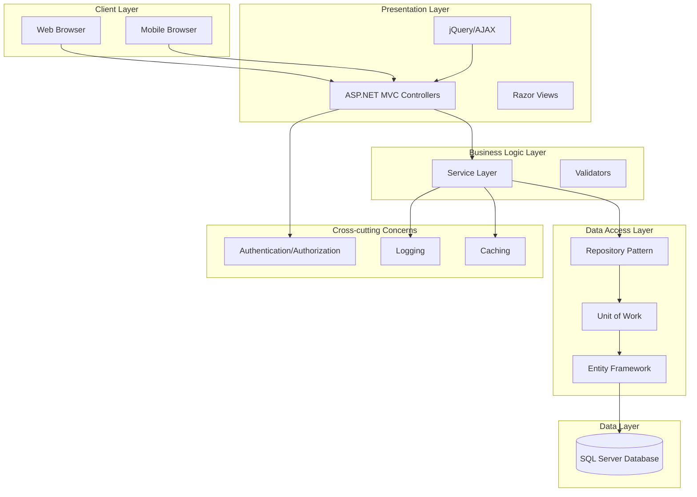
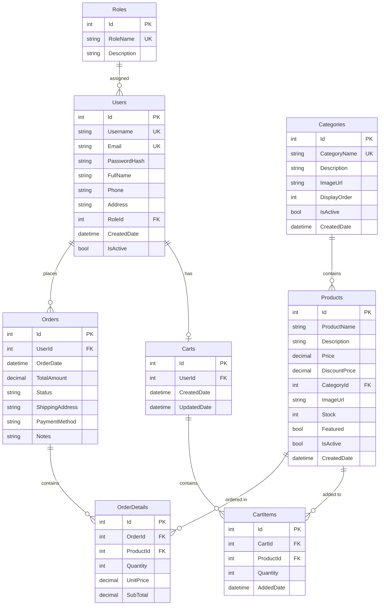

# TÀI LIỆU KỸ THUẬT - HỆ THỐNG BÁN QUẦN ÁO TRỰC TUYẾN

**Tên dự án:** FashionStore - Hệ thống bán quần áo trực tuyến  
**Công nghệ:** ASP.NET MVC, Entity Framework Code First  
**Phiên bản:** 1.0.0  
**Ngày tạo:** 2024

---

## MỤC LỤC

1. [PROJECT OVERVIEW](#1-project-overview)
2. [SYSTEM ARCHITECTURE](#2-system-architecture)
3. [DATABASE DESIGN](#3-database-design)
4. [CODE FIRST MODELS](#4-code-first-models)
5. [BUSINESS LOGIC & SERVICES](#5-business-logic--services)
6. [REPOSITORY LAYER](#6-repository-layer)
7. [API DESIGN](#7-api-design)
8. [AUTHENTICATION & AUTHORIZATION](#8-authentication--authorization)
9. [UI/UX DESIGN](#9-uiux-design)
10. [FOLDER STRUCTURE](#10-folder-structure)
11. [KEY FEATURES IMPLEMENTATION DETAILS](#11-key-features-implementation-details)
12. [VALIDATION & ERROR HANDLING](#12-validation--error-handling)
13. [PERFORMANCE OPTIMIZATION](#13-performance-optimization)
14. [SECURITY CONSIDERATIONS](#14-security-considerations)
15. [DEPLOYMENT STRATEGY](#15-deployment-strategy)
16. [TESTING STRATEGY](#16-testing-strategy)
17. [PROJECT TIMELINE & MILESTONES](#17-project-timeline--milestones)
18. [TEAM STRUCTURE & RESPONSIBILITIES](#18-team-structure--responsibilities)
19. [APPENDIX](#19-appendix)

---

## 1. PROJECT OVERVIEW

### 1.1. Tên dự án và Mô tả Tổng quan

**FashionStore** là một hệ thống thương mại điện tử (E-commerce) chuyên bán quần áo trực tuyến, được xây dựng trên nền tảng ASP.NET MVC với Entity Framework Code First. Hệ thống cung cấp đầy đủ các chức năng từ quản lý sản phẩm, đơn hàng đến trải nghiệm mua sắm cho người dùng cuối.

### 1.2. Mục tiêu Dự án

#### Mục tiêu Học tập
- Nắm vững kiến trúc ASP.NET MVC và Entity Framework Code First
- Áp dụng các Design Patterns (Repository, Unit of Work, Dependency Injection)
- Thực hành phân quyền và bảo mật trong web application
- Xây dựng RESTful API và tích hợp AJAX
- Phát triển kỹ năng full-stack development

#### Mục tiêu Thực tế
- Tạo nền tảng có thể mở rộng và deploy lên production
- Đảm bảo performance và security tốt
- Cung cấp trải nghiệm người dùng mượt mà, responsive
- Dễ dàng bảo trì và nâng cấp sau này

### 1.3. Phạm vi Dự án (Scope)

#### Trong phạm vi (In Scope)
- ✅ Hệ thống quản lý người dùng (đăng ký, đăng nhập, phân quyền)
- ✅ Quản lý sản phẩm và danh mục (CRUD)
- ✅ Giỏ hàng và thanh toán
- ✅ Quản lý đơn hàng
- ✅ Tìm kiếm và lọc sản phẩm
- ✅ Phân trang và sắp xếp
- ✅ Admin dashboard với thống kê cơ bản
- ✅ RESTful API cho sản phẩm
- ✅ AJAX integration

#### Ngoài phạm vi (Out of Scope)
- ❌ Tích hợp cổng thanh toán thực tế (PayPal, Stripe)
- ❌ Email notification system
- ❌ Inventory management nâng cao
- ❌ Multi-language support
- ❌ Mobile app
- ❌ Real-time chat support

### 1.4. Công nghệ Stack Chi tiết

#### Backend Framework
- **ASP.NET MVC 5** hoặc **ASP.NET Core MVC** (tùy yêu cầu)
- **Entity Framework 6.x** (Code First approach)
- **ASP.NET Identity** (Authentication & Authorization)

#### Frontend Technologies
- **Bootstrap 5.x** (Responsive UI framework)
- **jQuery 3.x** (DOM manipulation, AJAX)
- **Font Awesome 6.x** (Icons)
- **CSS3** (Custom styling)
- **JavaScript (Vanilla)** (Client-side logic)

#### Database
- **SQL Server** (Development & Production)
- **SQL Server LocalDB** (Local development)

#### Development Tools
- **Visual Studio 2022** (IDE)
- **Git** (Version control)
- **NuGet Package Manager** (Dependency management)

#### Libraries & Packages
- **PagedList.Mvc** (Pagination)
- **AutoMapper** (Object mapping)
- **NLog** hoặc **Serilog** (Logging)
- **FluentValidation** (Validation - optional)

#### Deployment
- **IIS** (Windows Server)
- **Azure App Service** (Cloud deployment option)

---

## 2. SYSTEM ARCHITECTURE

### 2.1. Kiến trúc Tổng thể (High-level Architecture)



### 2.2. Kiến trúc Phân lớp (Layered Architecture)

#### 2.2.1. Presentation Layer
**Trách nhiệm:**
- Xử lý HTTP requests/responses
- Routing và model binding
- Render views
- Client-side validation

**Components:**
- Controllers (HomeController, ProductController, CartController, etc.)
- Views (Razor views với Layout)
- ViewModels (Data transfer objects cho views)
- JavaScript files (AJAX calls, UI interactions)

#### 2.2.2. Business Logic Layer
**Trách nhiệm:**
- Business rules validation
- Business logic processing
- Transaction management
- Orchestration giữa các repositories

**Components:**
- Service Interfaces (IProductService, IOrderService, etc.)
- Service Implementations (ProductService, OrderService, etc.)
- Business validators
- DTOs (Data Transfer Objects)

#### 2.2.3. Data Access Layer
**Trách nhiệm:**
- Database operations (CRUD)
- Query optimization
- Entity mapping
- Transaction management

**Components:**
- Generic Repository (IRepository<T>)
- Specific Repositories (ProductRepository, OrderRepository, etc.)
- Unit of Work pattern
- DbContext (ApplicationDbContext)

#### 2.2.4. Cross-cutting Concerns
**Trách nhiệm:**
- Authentication & Authorization
- Logging
- Caching
- Error handling
- Security

**Components:**
- Custom attributes (Authorize, LogAction)
- Exception filters
- Action filters
- Helpers và Extensions

### 2.3. Design Patterns Sử dụng

#### 2.3.1. Repository Pattern
**Mục đích:** Tách biệt business logic khỏi data access logic

**Implementation:**
```csharp
public interface IRepository<T> where T : class
{
    T GetById(int id);
    IEnumerable<T> GetAll();
    void Add(T entity);
    void Update(T entity);
    void Delete(T entity);
    void SaveChanges();
}
```

**Lợi ích:**
- Dễ dàng thay đổi data source (SQL Server → MongoDB)
- Dễ dàng unit testing (mock repository)
- Tái sử dụng code

#### 2.3.2. Unit of Work Pattern
**Mục đích:** Quản lý transaction và đảm bảo consistency

**Implementation:**
```csharp
public interface IUnitOfWork : IDisposable
{
    IProductRepository Products { get; }
    IOrderRepository Orders { get; }
    IUserRepository Users { get; }
    int Complete();
}
```

**Lợi ích:**
- Đảm bảo atomic operations
- Quản lý DbContext lifecycle
- Tránh multiple SaveChanges() calls

#### 2.3.3. Dependency Injection
**Mục đích:** Giảm coupling, tăng testability

**Implementation:**
- Sử dụng built-in DI container của ASP.NET Core hoặc Unity/Ninject cho MVC 5
- Register services trong Startup.cs hoặc Global.asax

**Lợi ích:**
- Loose coupling
- Dễ dàng thay thế implementations
- Testability cao

#### 2.3.4. Service Layer Pattern
**Mục đích:** Tách biệt business logic khỏi presentation layer

**Implementation:**
- Mỗi domain entity có một service interface và implementation
- Services sử dụng repositories để truy cập data
- Controllers chỉ gọi services, không trực tiếp gọi repositories

---

## 3. DATABASE DESIGN

### 3.1. ER Diagram (Entity Relationship Diagram)



### 3.2. Chi tiết các Bảng

#### 3.2.1. Users
**Mục đích:** Lưu trữ thông tin người dùng

| Cột | Kiểu dữ liệu | Ràng buộc | Mô tả |
|-----|-------------|-----------|-------|
| Id | int | PK, Identity | Primary key |
| Username | nvarchar(50) | NOT NULL, UNIQUE | Tên đăng nhập |
| Email | nvarchar(100) | NOT NULL, UNIQUE | Email |
| PasswordHash | nvarchar(255) | NOT NULL | Mật khẩu đã hash |
| FullName | nvarchar(100) | NULL | Họ và tên |
| Phone | nvarchar(20) | NULL | Số điện thoại |
| Address | nvarchar(255) | NULL | Địa chỉ |
| RoleId | int | NOT NULL, FK → Roles | Vai trò |
| CreatedDate | datetime | NOT NULL, DEFAULT GETDATE() | Ngày tạo |
| IsActive | bit | NOT NULL, DEFAULT 1 | Trạng thái hoạt động |

**Indexes:**
- IX_Users_Email (Email)
- IX_Users_Username (Username)
- IX_Users_RoleId (RoleId)

#### 3.2.2. Roles
**Mục đích:** Quản lý phân quyền

| Cột | Kiểu dữ liệu | Ràng buộc | Mô tả |
|-----|-------------|-----------|-------|
| Id | int | PK, Identity | Primary key |
| RoleName | nvarchar(50) | NOT NULL, UNIQUE | Tên vai trò (Admin, User) |
| Description | nvarchar(255) | NULL | Mô tả |

#### 3.2.3. Categories
**Mục đích:** Phân loại sản phẩm

| Cột | Kiểu dữ liệu | Ràng buộc | Mô tả |
|-----|-------------|-----------|-------|
| Id | int | PK, Identity | Primary key |
| CategoryName | nvarchar(100) | NOT NULL, UNIQUE | Tên danh mục |
| Description | nvarchar(500) | NULL | Mô tả |
| ImageUrl | nvarchar(255) | NULL | URL hình ảnh |
| DisplayOrder | int | NOT NULL, DEFAULT 0 | Thứ tự hiển thị |
| IsActive | bit | NOT NULL, DEFAULT 1 | Trạng thái |
| CreatedDate | datetime | NOT NULL, DEFAULT GETDATE() | Ngày tạo |

#### 3.2.4. Products
**Mục đích:** Lưu trữ thông tin sản phẩm

| Cột | Kiểu dữ liệu | Ràng buộc | Mô tả |
|-----|-------------|-----------|-------|
| Id | int | PK, Identity | Primary key |
| ProductName | nvarchar(200) | NOT NULL | Tên sản phẩm |
| Description | nvarchar(MAX) | NULL | Mô tả chi tiết |
| Price | decimal(18,2) | NOT NULL | Giá gốc |
| DiscountPrice | decimal(18,2) | NULL | Giá khuyến mãi |
| CategoryId | int | NOT NULL, FK → Categories | Danh mục |
| ImageUrl | nvarchar(255) | NULL | URL hình ảnh chính |
| Stock | int | NOT NULL, DEFAULT 0 | Số lượng tồn kho |
| Featured | bit | NOT NULL, DEFAULT 0 | Sản phẩm nổi bật |
| IsActive | bit | NOT NULL, DEFAULT 1 | Trạng thái |
| CreatedDate | datetime | NOT NULL, DEFAULT GETDATE() | Ngày tạo |

**Indexes:**
- IX_Products_CategoryId (CategoryId)
- IX_Products_Featured (Featured)
- IX_Products_IsActive (IsActive)
- IX_Products_CreatedDate (CreatedDate)

#### 3.2.5. Orders
**Mục đích:** Quản lý đơn hàng

| Cột | Kiểu dữ liệu | Ràng buộc | Mô tả |
|-----|-------------|-----------|-------|
| Id | int | PK, Identity | Primary key |
| UserId | int | NOT NULL, FK → Users | Người đặt hàng |
| OrderDate | datetime | NOT NULL, DEFAULT GETDATE() | Ngày đặt hàng |
| TotalAmount | decimal(18,2) | NOT NULL | Tổng tiền |
| Status | nvarchar(50) | NOT NULL, DEFAULT 'Pending' | Trạng thái (Pending, Processing, Shipped, Delivered, Cancelled) |
| ShippingAddress | nvarchar(500) | NOT NULL | Địa chỉ giao hàng |
| PaymentMethod | nvarchar(50) | NULL | Phương thức thanh toán |
| Notes | nvarchar(500) | NULL | Ghi chú |

**Indexes:**
- IX_Orders_UserId (UserId)
- IX_Orders_OrderDate (OrderDate)
- IX_Orders_Status (Status)

#### 3.2.6. OrderDetails
**Mục đích:** Chi tiết các sản phẩm trong đơn hàng

| Cột | Kiểu dữ liệu | Ràng buộc | Mô tả |
|-----|-------------|-----------|-------|
| Id | int | PK, Identity | Primary key |
| OrderId | int | NOT NULL, FK → Orders | Đơn hàng |
| ProductId | int | NOT NULL, FK → Products | Sản phẩm |
| Quantity | int | NOT NULL, CHECK > 0 | Số lượng |
| UnitPrice | decimal(18,2) | NOT NULL | Giá đơn vị |
| SubTotal | decimal(18,2) | NOT NULL | Thành tiền |

**Indexes:**
- IX_OrderDetails_OrderId (OrderId)
- IX_OrderDetails_ProductId (ProductId)

#### 3.2.7. Carts
**Mục đích:** Quản lý giỏ hàng của người dùng

| Cột | Kiểu dữ liệu | Ràng buộc | Mô tả |
|-----|-------------|-----------|-------|
| Id | int | PK, Identity | Primary key |
| UserId | int | NOT NULL, FK → Users, UNIQUE | Người dùng |
| CreatedDate | datetime | NOT NULL, DEFAULT GETDATE() | Ngày tạo |
| UpdatedDate | datetime | NULL | Ngày cập nhật |

**Indexes:**
- IX_Carts_UserId (UserId) - UNIQUE

#### 3.2.8. CartItems
**Mục đích:** Các sản phẩm trong giỏ hàng

| Cột | Kiểu dữ liệu | Ràng buộc | Mô tả |
|-----|-------------|-----------|-------|
| Id | int | PK, Identity | Primary key |
| CartId | int | NOT NULL, FK → Carts | Giỏ hàng |
| ProductId | int | NOT NULL, FK → Products | Sản phẩm |
| Quantity | int | NOT NULL, CHECK > 0 | Số lượng |
| AddedDate | datetime | NOT NULL, DEFAULT GETDATE() | Ngày thêm |

**Indexes:**
- IX_CartItems_CartId (CartId)
- IX_CartItems_ProductId (ProductId)
- UNIQUE (CartId, ProductId) - Một sản phẩm chỉ xuất hiện một lần trong giỏ

### 3.3. Relationships và Constraints

#### Foreign Key Constraints
- `Users.RoleId` → `Roles.Id` (CASCADE DELETE: NO ACTION)
- `Products.CategoryId` → `Categories.Id` (CASCADE DELETE: NO ACTION)
- `Orders.UserId` → `Users.Id` (CASCADE DELETE: NO ACTION)
- `OrderDetails.OrderId` → `Orders.Id` (CASCADE DELETE: CASCADE)
- `OrderDetails.ProductId` → `Products.Id` (CASCADE DELETE: NO ACTION)
- `Carts.UserId` → `Users.Id` (CASCADE DELETE: CASCADE)
- `CartItems.CartId` → `Carts.Id` (CASCADE DELETE: CASCADE)
- `CartItems.ProductId` → `Products.Id` (CASCADE DELETE: NO ACTION)

#### Check Constraints
- `Products.Price >= 0`
- `Products.DiscountPrice >= 0`
- `Products.Stock >= 0`
- `Orders.TotalAmount >= 0`
- `OrderDetails.Quantity > 0`
- `OrderDetails.UnitPrice >= 0`
- `CartItems.Quantity > 0`

---

## 4. CODE FIRST MODELS

### 4.1. Entity Models với Data Annotations

#### 4.1.1. User Model
```csharp
using System;
using System.ComponentModel.DataAnnotations;
using System.ComponentModel.DataAnnotations.Schema;

namespace FashionStore.Models.Entities
{
    public class User
    {
        [Key]
        public int Id { get; set; }

        [Required(ErrorMessage = "Tên đăng nhập là bắt buộc")]
        [StringLength(50, MinimumLength = 3, ErrorMessage = "Tên đăng nhập phải từ 3-50 ký tự")]
        [Index("IX_Users_Username", IsUnique = true)]
        public string Username { get; set; }

        [Required(ErrorMessage = "Email là bắt buộc")]
        [EmailAddress(ErrorMessage = "Email không hợp lệ")]
        [StringLength(100)]
        [Index("IX_Users_Email", IsUnique = true)]
        public string Email { get; set; }

        [Required]
        [StringLength(255)]
        public string PasswordHash { get; set; }

        [StringLength(100)]
        [Display(Name = "Họ và tên")]
        public string FullName { get; set; }

        [StringLength(20)]
        [Phone(ErrorMessage = "Số điện thoại không hợp lệ")]
        public string Phone { get; set; }

        [StringLength(255)]
        public string Address { get; set; }

        [Required]
        [ForeignKey("Role")]
        public int RoleId { get; set; }

        public virtual Role Role { get; set; }

        [Required]
        [DataType(DataType.DateTime)]
        public DateTime CreatedDate { get; set; } = DateTime.Now;

        [Required]
        public bool IsActive { get; set; } = true;

        // Navigation properties
        public virtual ICollection<Order> Orders { get; set; }
        public virtual Cart Cart { get; set; }
    }
}
```

#### 4.1.2. Role Model
```csharp
using System.Collections.Generic;
using System.ComponentModel.DataAnnotations;

namespace FashionStore.Models.Entities
{
    public class Role
    {
        [Key]
        public int Id { get; set; }

        [Required(ErrorMessage = "Tên vai trò là bắt buộc")]
        [StringLength(50)]
        [Index("IX_Roles_RoleName", IsUnique = true)]
        public string RoleName { get; set; }

        [StringLength(255)]
        public string Description { get; set; }

        // Navigation properties
        public virtual ICollection<User> Users { get; set; }
    }
}
```

#### 4.1.3. Category Model
```csharp
using System;
using System.Collections.Generic;
using System.ComponentModel.DataAnnotations;
using System.ComponentModel.DataAnnotations.Schema;

namespace FashionStore.Models.Entities
{
    public class Category
    {
        [Key]
        public int Id { get; set; }

        [Required(ErrorMessage = "Tên danh mục là bắt buộc")]
        [StringLength(100)]
        [Index("IX_Categories_CategoryName", IsUnique = true)]
        [Display(Name = "Tên danh mục")]
        public string CategoryName { get; set; }

        [StringLength(500)]
        [Display(Name = "Mô tả")]
        public string Description { get; set; }

        [StringLength(255)]
        [Display(Name = "Hình ảnh")]
        public string ImageUrl { get; set; }

        [Required]
        [Display(Name = "Thứ tự hiển thị")]
        public int DisplayOrder { get; set; } = 0;

        [Required]
        [Display(Name = "Kích hoạt")]
        public bool IsActive { get; set; } = true;

        [Required]
        [DataType(DataType.DateTime)]
        public DateTime CreatedDate { get; set; } = DateTime.Now;

        // Navigation properties
        public virtual ICollection<Product> Products { get; set; }
    }
}
```

#### 4.1.4. Product Model
```csharp
using System;
using System.ComponentModel.DataAnnotations;
using System.ComponentModel.DataAnnotations.Schema;

namespace FashionStore.Models.Entities
{
    public class Product
    {
        [Key]
        public int Id { get; set; }

        [Required(ErrorMessage = "Tên sản phẩm là bắt buộc")]
        [StringLength(200)]
        [Display(Name = "Tên sản phẩm")]
        public string ProductName { get; set; }

        [Display(Name = "Mô tả")]
        [DataType(DataType.MultilineText)]
        public string Description { get; set; }

        [Required(ErrorMessage = "Giá là bắt buộc")]
        [Range(0, double.MaxValue, ErrorMessage = "Giá phải lớn hơn 0")]
        [DataType(DataType.Currency)]
        [Display(Name = "Giá")]
        [Column(TypeName = "decimal(18,2)")]
        public decimal Price { get; set; }

        [Range(0, double.MaxValue, ErrorMessage = "Giá khuyến mãi phải lớn hơn 0")]
        [DataType(DataType.Currency)]
        [Display(Name = "Giá khuyến mãi")]
        [Column(TypeName = "decimal(18,2)")]
        public decimal? DiscountPrice { get; set; }

        [Required]
        [ForeignKey("Category")]
        [Display(Name = "Danh mục")]
        public int CategoryId { get; set; }

        public virtual Category Category { get; set; }

        [StringLength(255)]
        [Display(Name = "Hình ảnh")]
        public string ImageUrl { get; set; }

        [Required]
        [Range(0, int.MaxValue, ErrorMessage = "Số lượng tồn kho phải >= 0")]
        [Display(Name = "Tồn kho")]
        public int Stock { get; set; } = 0;

        [Required]
        [Display(Name = "Sản phẩm nổi bật")]
        public bool Featured { get; set; } = false;

        [Required]
        [Display(Name = "Kích hoạt")]
        public bool IsActive { get; set; } = true;

        [Required]
        [DataType(DataType.DateTime)]
        [Display(Name = "Ngày tạo")]
        public DateTime CreatedDate { get; set; } = DateTime.Now;

        // Navigation properties
        public virtual ICollection<OrderDetail> OrderDetails { get; set; }
        public virtual ICollection<CartItem> CartItems { get; set; }

        // Computed property
        [NotMapped]
        public decimal FinalPrice => DiscountPrice ?? Price;
    }
}
```

#### 4.1.5. Order Model
```csharp
using System;
using System.Collections.Generic;
using System.ComponentModel.DataAnnotations;
using System.ComponentModel.DataAnnotations.Schema;

namespace FashionStore.Models.Entities
{
    public class Order
    {
        [Key]
        public int Id { get; set; }

        [Required]
        [ForeignKey("User")]
        public int UserId { get; set; }

        public virtual User User { get; set; }

        [Required]
        [DataType(DataType.DateTime)]
        [Display(Name = "Ngày đặt hàng")]
        public DateTime OrderDate { get; set; } = DateTime.Now;

        [Required]
        [Range(0, double.MaxValue)]
        [DataType(DataType.Currency)]
        [Display(Name = "Tổng tiền")]
        [Column(TypeName = "decimal(18,2)")]
        public decimal TotalAmount { get; set; }

        [Required]
        [StringLength(50)]
        [Display(Name = "Trạng thái")]
        public string Status { get; set; } = "Pending";

        [Required]
        [StringLength(500)]
        [Display(Name = "Địa chỉ giao hàng")]
        public string ShippingAddress { get; set; }

        [StringLength(50)]
        [Display(Name = "Phương thức thanh toán")]
        public string PaymentMethod { get; set; }

        [StringLength(500)]
        [Display(Name = "Ghi chú")]
        public string Notes { get; set; }

        // Navigation properties
        public virtual ICollection<OrderDetail> OrderDetails { get; set; }
    }
}
```

#### 4.1.6. OrderDetail Model
```csharp
using System.ComponentModel.DataAnnotations;
using System.ComponentModel.DataAnnotations.Schema;

namespace FashionStore.Models.Entities
{
    public class OrderDetail
    {
        [Key]
        public int Id { get; set; }

        [Required]
        [ForeignKey("Order")]
        public int OrderId { get; set; }

        public virtual Order Order { get; set; }

        [Required]
        [ForeignKey("Product")]
        public int ProductId { get; set; }

        public virtual Product Product { get; set; }

        [Required]
        [Range(1, int.MaxValue, ErrorMessage = "Số lượng phải lớn hơn 0")]
        [Display(Name = "Số lượng")]
        public int Quantity { get; set; }

        [Required]
        [Range(0, double.MaxValue)]
        [DataType(DataType.Currency)]
        [Display(Name = "Đơn giá")]
        [Column(TypeName = "decimal(18,2)")]
        public decimal UnitPrice { get; set; }

        [Required]
        [Range(0, double.MaxValue)]
        [DataType(DataType.Currency)]
        [Display(Name = "Thành tiền")]
        [Column(TypeName = "decimal(18,2)")]
        public decimal SubTotal { get; set; }
    }
}
```

#### 4.1.7. Cart Model
```csharp
using System;
using System.ComponentModel.DataAnnotations;
using System.ComponentModel.DataAnnotations.Schema;

namespace FashionStore.Models.Entities
{
    public class Cart
    {
        [Key]
        public int Id { get; set; }

        [Required]
        [ForeignKey("User")]
        [Index("IX_Carts_UserId", IsUnique = true)]
        public int UserId { get; set; }

        public virtual User User { get; set; }

        [Required]
        [DataType(DataType.DateTime)]
        public DateTime CreatedDate { get; set; } = DateTime.Now;

        [DataType(DataType.DateTime)]
        public DateTime? UpdatedDate { get; set; }

        // Navigation properties
        public virtual ICollection<CartItem> CartItems { get; set; }
    }
}
```

#### 4.1.8. CartItem Model
```csharp
using System;
using System.ComponentModel.DataAnnotations;
using System.ComponentModel.DataAnnotations.Schema;

namespace FashionStore.Models.Entities
{
    public class CartItem
    {
        [Key]
        public int Id { get; set; }

        [Required]
        [ForeignKey("Cart")]
        public int CartId { get; set; }

        public virtual Cart Cart { get; set; }

        [Required]
        [ForeignKey("Product")]
        public int ProductId { get; set; }

        public virtual Product Product { get; set; }

        [Required]
        [Range(1, int.MaxValue, ErrorMessage = "Số lượng phải lớn hơn 0")]
        [Display(Name = "Số lượng")]
        public int Quantity { get; set; }

        [Required]
        [DataType(DataType.DateTime)]
        public DateTime AddedDate { get; set; } = DateTime.Now;
    }
}
```

### 4.2. DbContext Configuration

```csharp
using System.Data.Entity;
using FashionStore.Models.Entities;
using System.Data.Entity.ModelConfiguration.Conventions;

namespace FashionStore.Data
{
    public class ApplicationDbContext : DbContext
    {
        public ApplicationDbContext() : base("DefaultConnection")
        {
            // Disable initializer in production
            Database.SetInitializer<ApplicationDbContext>(new CreateDatabaseIfNotExists<ApplicationDbContext>());
        }

        public DbSet<User> Users { get; set; }
        public DbSet<Role> Roles { get; set; }
        public DbSet<Category> Categories { get; set; }
        public DbSet<Product> Products { get; set; }
        public DbSet<Order> Orders { get; set; }
        public DbSet<OrderDetail> OrderDetails { get; set; }
        public DbSet<Cart> Carts { get; set; }
        public DbSet<CartItem> CartItems { get; set; }

        protected override void OnModelCreating(DbModelBuilder modelBuilder)
        {
            base.OnModelCreating(modelBuilder);

            // Remove pluralization
            modelBuilder.Conventions.Remove<PluralizingTableNameConvention>();

            // Configure relationships
            ConfigureRelationships(modelBuilder);

            // Configure indexes
            ConfigureIndexes(modelBuilder);
        }

        private void ConfigureRelationships(DbModelBuilder modelBuilder)
        {
            // User - Role relationship
            modelBuilder.Entity<User>()
                .HasRequired(u => u.Role)
                .WithMany(r => r.Users)
                .HasForeignKey(u => u.RoleId)
                .WillCascadeOnDelete(false);

            // Product - Category relationship
            modelBuilder.Entity<Product>()
                .HasRequired(p => p.Category)
                .WithMany(c => c.Products)
                .HasForeignKey(p => p.CategoryId)
                .WillCascadeOnDelete(false);

            // Order - User relationship
            modelBuilder.Entity<Order>()
                .HasRequired(o => o.User)
                .WithMany(u => u.Orders)
                .HasForeignKey(o => o.UserId)
                .WillCascadeOnDelete(false);

            // OrderDetail - Order relationship (CASCADE DELETE)
            modelBuilder.Entity<OrderDetail>()
                .HasRequired(od => od.Order)
                .WithMany(o => o.OrderDetails)
                .HasForeignKey(od => od.OrderId)
                .WillCascadeOnDelete(true);

            // OrderDetail - Product relationship
            modelBuilder.Entity<OrderDetail>()
                .HasRequired(od => od.Product)
                .WithMany(p => p.OrderDetails)
                .HasForeignKey(od => od.ProductId)
                .WillCascadeOnDelete(false);

            // Cart - User relationship (CASCADE DELETE)
            modelBuilder.Entity<Cart>()
                .HasRequired(c => c.User)
                .WithMany(u => u.Carts)
                .HasForeignKey(c => c.UserId)
                .WillCascadeOnDelete(true);

            // CartItem - Cart relationship (CASCADE DELETE)
            modelBuilder.Entity<CartItem>()
                .HasRequired(ci => ci.Cart)
                .WithMany(c => c.CartItems)
                .HasForeignKey(ci => ci.CartId)
                .WillCascadeOnDelete(true);

            // CartItem - Product relationship
            modelBuilder.Entity<CartItem>()
                .HasRequired(ci => ci.Product)
                .WithMany(p => p.CartItems)
                .HasForeignKey(ci => ci.ProductId)
                .WillCascadeOnDelete(false);

            // Unique constraint: One product per cart
            modelBuilder.Entity<CartItem>()
                .HasIndex(ci => new { ci.CartId, ci.ProductId })
                .IsUnique();
        }

        private void ConfigureIndexes(DbModelBuilder modelBuilder)
        {
            // Product indexes
            modelBuilder.Entity<Product>()
                .HasIndex(p => p.CategoryId)
                .HasName("IX_Products_CategoryId");

            modelBuilder.Entity<Product>()
                .HasIndex(p => p.Featured)
                .HasName("IX_Products_Featured");

            modelBuilder.Entity<Product>()
                .HasIndex(p => p.IsActive)
                .HasName("IX_Products_IsActive");

            modelBuilder.Entity<Product>()
                .HasIndex(p => p.CreatedDate)
                .HasName("IX_Products_CreatedDate");

            // Order indexes
            modelBuilder.Entity<Order>()
                .HasIndex(o => o.UserId)
                .HasName("IX_Orders_UserId");

            modelBuilder.Entity<Order>()
                .HasIndex(o => o.OrderDate)
                .HasName("IX_Orders_OrderDate");

            modelBuilder.Entity<Order>()
                .HasIndex(o => o.Status)
                .HasName("IX_Orders_Status");
        }
    }
}
```

### 4.3. Seed Data (Khởi tạo Dữ liệu Mẫu)

```csharp
using System.Data.Entity;
using FashionStore.Models.Entities;
using System;

namespace FashionStore.Data
{
    public class DatabaseInitializer : CreateDatabaseIfNotExists<ApplicationDbContext>
    {
        protected override void Seed(ApplicationDbContext context)
        {
            // Seed Roles
            var adminRole = new Role { RoleName = "Admin", Description = "Quản trị viên" };
            var userRole = new Role { RoleName = "User", Description = "Người dùng" };
            context.Roles.Add(adminRole);
            context.Roles.Add(userRole);

            // Seed Admin User
            var adminUser = new User
            {
                Username = "admin",
                Email = "admin@fashionstore.com",
                PasswordHash = BCrypt.Net.BCrypt.HashPassword("Admin@123"), // Sử dụng BCrypt để hash password
                FullName = "Administrator",
                Phone = "0123456789",
                RoleId = 1, // Admin role
                CreatedDate = DateTime.Now,
                IsActive = true
            };
            context.Users.Add(adminUser);

            // Seed Categories
            var categories = new[]
            {
                new Category { CategoryName = "Áo Nam", Description = "Áo sơ mi, áo thun nam", DisplayOrder = 1, IsActive = true },
                new Category { CategoryName = "Áo Nữ", Description = "Áo sơ mi, áo thun nữ", DisplayOrder = 2, IsActive = true },
                new Category { CategoryName = "Quần Nam", Description = "Quần jean, quần tây nam", DisplayOrder = 3, IsActive = true },
                new Category { CategoryName = "Quần Nữ", Description = "Quần jean, quần short nữ", DisplayOrder = 4, IsActive = true },
                new Category { CategoryName = "Váy", Description = "Váy đầm, chân váy", DisplayOrder = 5, IsActive = true }
            };
            context.Categories.AddRange(categories);

            // Seed Products
            var products = new[]
            {
                new Product
                {
                    ProductName = "Áo Sơ Mi Nam Trắng",
                    Description = "Áo sơ mi nam form rộng, chất liệu cotton cao cấp",
                    Price = 299000,
                    DiscountPrice = 249000,
                    CategoryId = 1,
                    ImageUrl = "/images/products/ao-so-mi-nam-trang.jpg",
                    Stock = 50,
                    Featured = true,
                    IsActive = true,
                    CreatedDate = DateTime.Now
                },
                new Product
                {
                    ProductName = "Áo Thun Nữ Cổ Tròn",
                    Description = "Áo thun nữ basic, nhiều màu sắc",
                    Price = 199000,
                    DiscountPrice = 149000,
                    CategoryId = 2,
                    ImageUrl = "/images/products/ao-thun-nu.jpg",
                    Stock = 100,
                    Featured = true,
                    IsActive = true,
                    CreatedDate = DateTime.Now
                },
                new Product
                {
                    ProductName = "Quần Jean Nam",
                    Description = "Quần jean nam form slim, chất liệu denim",
                    Price = 599000,
                    CategoryId = 3,
                    ImageUrl = "/images/products/quan-jean-nam.jpg",
                    Stock = 30,
                    Featured = false,
                    IsActive = true,
                    CreatedDate = DateTime.Now
                }
            };
            context.Products.AddRange(products);

            context.SaveChanges();
            base.Seed(context);
        }
    }
}
```

---

## 5. BUSINESS LOGIC & SERVICES

### 5.1. Service Layer Pattern

Service Layer đóng vai trò trung gian giữa Presentation Layer (Controllers) và Data Access Layer (Repositories), chứa business logic và validation rules.

**Nguyên tắc:**
- Controllers chỉ gọi Services, không trực tiếp gọi Repositories
- Services sử dụng Repositories để truy cập data
- Business logic được tập trung trong Services
- Mỗi Service có Interface riêng để dễ dàng test và mock

### 5.2. Service Interfaces

#### 5.2.1. IProductService
```csharp
using FashionStore.Models.Entities;
using FashionStore.Models.ViewModels;
using System.Collections.Generic;

namespace FashionStore.Services.Interfaces
{
    public interface IProductService
    {
        // CRUD Operations
        Product GetById(int id);
        IEnumerable<Product> GetAll();
        IEnumerable<Product> GetActiveProducts();
        void Add(Product product);
        void Update(Product product);
        void Delete(int id);
        
        // Business Operations
        IEnumerable<Product> GetFeaturedProducts(int count = 8);
        IEnumerable<Product> GetLatestProducts(int count = 8);
        IEnumerable<Product> GetProductsByCategory(int categoryId);
        IEnumerable<Product> SearchProducts(string searchTerm);
        IEnumerable<Product> GetProductsWithPaging(int page, int pageSize, out int totalCount);
        IEnumerable<Product> FilterProducts(int? categoryId, decimal? minPrice, decimal? maxPrice, bool? featured);
        
        // Stock Management
        bool CheckStock(int productId, int quantity);
        void UpdateStock(int productId, int quantity);
    }
}
```

#### 5.2.2. IOrderService
```csharp
using FashionStore.Models.Entities;
using FashionStore.Models.ViewModels;
using System.Collections.Generic;

namespace FashionStore.Services.Interfaces
{
    public interface IOrderService
    {
        Order GetById(int id);
        IEnumerable<Order> GetAll();
        IEnumerable<Order> GetOrdersByUser(int userId);
        void CreateOrder(Order order, List<OrderDetail> orderDetails);
        void UpdateOrderStatus(int orderId, string status);
        
        // Business Operations
        decimal CalculateOrderTotal(List<OrderDetail> orderDetails);
        bool ValidateOrder(List<OrderDetail> orderDetails);
        IEnumerable<Order> GetOrdersByStatus(string status);
        OrderStatistics GetOrderStatistics();
    }
    
    public class OrderStatistics
    {
        public int TotalOrders { get; set; }
        public decimal TotalRevenue { get; set; }
        public int PendingOrders { get; set; }
        public int CompletedOrders { get; set; }
    }
}
```

#### 5.2.3. ICartService
```csharp
using FashionStore.Models.Entities;
using FashionStore.Models.ViewModels;
using System.Collections.Generic;

namespace FashionStore.Services.Interfaces
{
    public interface ICartService
    {
        Cart GetCartByUserId(int userId);
        Cart CreateCart(int userId);
        void AddToCart(int userId, int productId, int quantity);
        void UpdateCartItem(int cartItemId, int quantity);
        void RemoveCartItem(int cartItemId);
        void ClearCart(int userId);
        
        // Business Operations
        CartViewModel GetCartViewModel(int userId);
        decimal CalculateCartTotal(int userId);
        int GetCartItemCount(int userId);
        bool ValidateCart(int userId);
    }
}
```

#### 5.2.4. IUserService
```csharp
using FashionStore.Models.Entities;
using FashionStore.Models.ViewModels;

namespace FashionStore.Services.Interfaces
{
    public interface IUserService
    {
        User GetById(int id);
        User GetByUsername(string username);
        User GetByEmail(string email);
        void Register(RegisterViewModel model);
        bool Login(LoginViewModel model);
        void UpdateProfile(int userId, UserProfileViewModel model);
        void ChangePassword(int userId, string oldPassword, string newPassword);
        bool ValidateUser(string username, string password);
    }
}
```

#### 5.2.5. ICategoryService
```csharp
using FashionStore.Models.Entities;
using System.Collections.Generic;

namespace FashionStore.Services.Interfaces
{
    public interface ICategoryService
    {
        Category GetById(int id);
        IEnumerable<Category> GetAll();
        IEnumerable<Category> GetActiveCategories();
        void Add(Category category);
        void Update(Category category);
        void Delete(int id);
        int GetProductCount(int categoryId);
    }
}
```

### 5.3. Service Implementations

#### 5.3.1. ProductService
```csharp
using FashionStore.Models.Entities;
using FashionStore.Repositories.Interfaces;
using FashionStore.Services.Interfaces;
using System.Collections.Generic;
using System.Linq;

namespace FashionStore.Services.Implementations
{
    public class ProductService : IProductService
    {
        private readonly IProductRepository _productRepository;
        private readonly IUnitOfWork _unitOfWork;

        public ProductService(IProductRepository productRepository, IUnitOfWork unitOfWork)
        {
            _productRepository = productRepository;
            _unitOfWork = unitOfWork;
        }

        public Product GetById(int id)
        {
            return _productRepository.GetById(id);
        }

        public IEnumerable<Product> GetAll()
        {
            return _productRepository.GetAll();
        }

        public IEnumerable<Product> GetActiveProducts()
        {
            return _productRepository.Find(p => p.IsActive);
        }

        public void Add(Product product)
        {
            if (product == null)
                throw new ArgumentNullException(nameof(product));

            if (string.IsNullOrWhiteSpace(product.ProductName))
                throw new ArgumentException("Tên sản phẩm không được để trống");

            if (product.Price < 0)
                throw new ArgumentException("Giá sản phẩm phải >= 0");

            _productRepository.Add(product);
            _unitOfWork.Complete();
        }

        public void Update(Product product)
        {
            if (product == null)
                throw new ArgumentNullException(nameof(product));

            var existingProduct = _productRepository.GetById(product.Id);
            if (existingProduct == null)
                throw new InvalidOperationException("Sản phẩm không tồn tại");

            existingProduct.ProductName = product.ProductName;
            existingProduct.Description = product.Description;
            existingProduct.Price = product.Price;
            existingProduct.DiscountPrice = product.DiscountPrice;
            existingProduct.CategoryId = product.CategoryId;
            existingProduct.ImageUrl = product.ImageUrl;
            existingProduct.Stock = product.Stock;
            existingProduct.Featured = product.Featured;
            existingProduct.IsActive = product.IsActive;

            _productRepository.Update(existingProduct);
            _unitOfWork.Complete();
        }

        public void Delete(int id)
        {
            var product = _productRepository.GetById(id);
            if (product == null)
                throw new InvalidOperationException("Sản phẩm không tồn tại");

            // Soft delete
            product.IsActive = false;
            _productRepository.Update(product);
            _unitOfWork.Complete();
        }

        public IEnumerable<Product> GetFeaturedProducts(int count = 8)
        {
            return _productRepository
                .Find(p => p.Featured && p.IsActive)
                .OrderByDescending(p => p.CreatedDate)
                .Take(count);
        }

        public IEnumerable<Product> GetLatestProducts(int count = 8)
        {
            return _productRepository
                .Find(p => p.IsActive)
                .OrderByDescending(p => p.CreatedDate)
                .Take(count);
        }

        public IEnumerable<Product> GetProductsByCategory(int categoryId)
        {
            return _productRepository
                .Find(p => p.CategoryId == categoryId && p.IsActive);
        }

        public IEnumerable<Product> SearchProducts(string searchTerm)
        {
            if (string.IsNullOrWhiteSpace(searchTerm))
                return GetActiveProducts();

            var term = searchTerm.ToLower();
            return _productRepository
                .Find(p => p.IsActive && 
                    (p.ProductName.ToLower().Contains(term) || 
                     p.Description.ToLower().Contains(term)));
        }

        public IEnumerable<Product> GetProductsWithPaging(int page, int pageSize, out int totalCount)
        {
            var products = GetActiveProducts();
            totalCount = products.Count();
            
            return products
                .OrderByDescending(p => p.CreatedDate)
                .Skip((page - 1) * pageSize)
                .Take(pageSize);
        }

        public IEnumerable<Product> FilterProducts(int? categoryId, decimal? minPrice, decimal? maxPrice, bool? featured)
        {
            var query = _productRepository.Find(p => p.IsActive);

            if (categoryId.HasValue)
                query = query.Where(p => p.CategoryId == categoryId.Value);

            if (minPrice.HasValue)
                query = query.Where(p => p.FinalPrice >= minPrice.Value);

            if (maxPrice.HasValue)
                query = query.Where(p => p.FinalPrice <= maxPrice.Value);

            if (featured.HasValue)
                query = query.Where(p => p.Featured == featured.Value);

            return query;
        }

        public bool CheckStock(int productId, int quantity)
        {
            var product = GetById(productId);
            return product != null && product.Stock >= quantity;
        }

        public void UpdateStock(int productId, int quantity)
        {
            var product = GetById(productId);
            if (product == null)
                throw new InvalidOperationException("Sản phẩm không tồn tại");

            if (product.Stock < quantity)
                throw new InvalidOperationException("Số lượng tồn kho không đủ");

            product.Stock -= quantity;
            _productRepository.Update(product);
            _unitOfWork.Complete();
        }
    }
}
```

#### 5.3.2. OrderService
```csharp
using FashionStore.Models.Entities;
using FashionStore.Repositories.Interfaces;
using FashionStore.Services.Interfaces;
using System;
using System.Collections.Generic;
using System.Linq;

namespace FashionStore.Services.Implementations
{
    public class OrderService : IOrderService
    {
        private readonly IOrderRepository _orderRepository;
        private readonly IOrderDetailRepository _orderDetailRepository;
        private readonly IProductService _productService;
        private readonly IUnitOfWork _unitOfWork;

        public OrderService(
            IOrderRepository orderRepository,
            IOrderDetailRepository orderDetailRepository,
            IProductService productService,
            IUnitOfWork unitOfWork)
        {
            _orderRepository = orderRepository;
            _orderDetailRepository = orderDetailRepository;
            _productService = productService;
            _unitOfWork = unitOfWork;
        }

        public Order GetById(int id)
        {
            return _orderRepository.GetById(id);
        }

        public IEnumerable<Order> GetAll()
        {
            return _orderRepository.GetAll();
        }

        public IEnumerable<Order> GetOrdersByUser(int userId)
        {
            return _orderRepository.Find(o => o.UserId == userId)
                .OrderByDescending(o => o.OrderDate);
        }

        public void CreateOrder(Order order, List<OrderDetail> orderDetails)
        {
            if (order == null)
                throw new ArgumentNullException(nameof(order));

            if (orderDetails == null || !orderDetails.Any())
                throw new ArgumentException("Đơn hàng phải có ít nhất một sản phẩm");

            // Validate order
            if (!ValidateOrder(orderDetails))
                throw new InvalidOperationException("Đơn hàng không hợp lệ");

            // Calculate total
            order.TotalAmount = CalculateOrderTotal(orderDetails);
            order.OrderDate = DateTime.Now;
            order.Status = "Pending";

            // Create order
            _orderRepository.Add(order);
            _unitOfWork.Complete();

            // Create order details and update stock
            foreach (var detail in orderDetails)
            {
                detail.OrderId = order.Id;
                _orderDetailRepository.Add(detail);
                _productService.UpdateStock(detail.ProductId, detail.Quantity);
            }

            _unitOfWork.Complete();
        }

        public void UpdateOrderStatus(int orderId, string status)
        {
            var order = GetById(orderId);
            if (order == null)
                throw new InvalidOperationException("Đơn hàng không tồn tại");

            var validStatuses = new[] { "Pending", "Processing", "Shipped", "Delivered", "Cancelled" };
            if (!validStatuses.Contains(status))
                throw new ArgumentException("Trạng thái không hợp lệ");

            order.Status = status;
            _orderRepository.Update(order);
            _unitOfWork.Complete();
        }

        public decimal CalculateOrderTotal(List<OrderDetail> orderDetails)
        {
            return orderDetails.Sum(od => od.SubTotal);
        }

        public bool ValidateOrder(List<OrderDetail> orderDetails)
        {
            foreach (var detail in orderDetails)
            {
                if (!_productService.CheckStock(detail.ProductId, detail.Quantity))
                    return false;
            }
            return true;
        }

        public IEnumerable<Order> GetOrdersByStatus(string status)
        {
            return _orderRepository.Find(o => o.Status == status)
                .OrderByDescending(o => o.OrderDate);
        }

        public OrderStatistics GetOrderStatistics()
        {
            var orders = GetAll().ToList();
            return new OrderStatistics
            {
                TotalOrders = orders.Count,
                TotalRevenue = orders.Where(o => o.Status == "Delivered").Sum(o => o.TotalAmount),
                PendingOrders = orders.Count(o => o.Status == "Pending"),
                CompletedOrders = orders.Count(o => o.Status == "Delivered")
            };
        }
    }
}
```

### 5.4. ViewModels

#### 5.4.1. ProductViewModel
```csharp
using System.ComponentModel.DataAnnotations;

namespace FashionStore.Models.ViewModels
{
    public class ProductViewModel
    {
        public int Id { get; set; }
        
        [Required(ErrorMessage = "Tên sản phẩm là bắt buộc")]
        [Display(Name = "Tên sản phẩm")]
        public string ProductName { get; set; }
        
        [Display(Name = "Mô tả")]
        public string Description { get; set; }
        
        [Required]
        [Range(0, double.MaxValue)]
        [Display(Name = "Giá")]
        public decimal Price { get; set; }
        
        [Display(Name = "Giá khuyến mãi")]
        public decimal? DiscountPrice { get; set; }
        
        [Required]
        [Display(Name = "Danh mục")]
        public int CategoryId { get; set; }
        
        [Display(Name = "Hình ảnh")]
        public string ImageUrl { get; set; }
        
        [Required]
        [Range(0, int.MaxValue)]
        [Display(Name = "Tồn kho")]
        public int Stock { get; set; }
        
        [Display(Name = "Sản phẩm nổi bật")]
        public bool Featured { get; set; }
        
        [Display(Name = "Kích hoạt")]
        public bool IsActive { get; set; }
        
        // Additional properties for display
        public string CategoryName { get; set; }
        public decimal FinalPrice => DiscountPrice ?? Price;
    }
}
```

#### 5.4.2. CartViewModel
```csharp
using System.Collections.Generic;

namespace FashionStore.Models.ViewModels
{
    public class CartViewModel
    {
        public int CartId { get; set; }
        public List<CartItemViewModel> Items { get; set; }
        public decimal TotalAmount { get; set; }
        public int TotalItems { get; set; }
    }

    public class CartItemViewModel
    {
        public int Id { get; set; }
        public int ProductId { get; set; }
        public string ProductName { get; set; }
        public string ImageUrl { get; set; }
        public decimal Price { get; set; }
        public decimal? DiscountPrice { get; set; }
        public int Quantity { get; set; }
        public decimal SubTotal { get; set; }
        public int Stock { get; set; }
        
        public decimal FinalPrice => DiscountPrice ?? Price;
    }
}
```

---

## 6. REPOSITORY LAYER

### 6.1. Generic Repository Pattern

Generic Repository cung cấp các operations cơ bản (CRUD) cho tất cả entities, giúp giảm code duplication.

#### 6.1.1. IRepository<T>
```csharp
using System;
using System.Collections.Generic;
using System.Linq.Expressions;

namespace FashionStore.Repositories.Interfaces
{
    public interface IRepository<T> where T : class
    {
        // Basic CRUD
        T GetById(int id);
        IEnumerable<T> GetAll();
        IEnumerable<T> Find(Expression<Func<T, bool>> predicate);
        T SingleOrDefault(Expression<Func<T, bool>> predicate);
        
        // Write Operations
        void Add(T entity);
        void AddRange(IEnumerable<T> entities);
        void Update(T entity);
        void Remove(T entity);
        void RemoveRange(IEnumerable<T> entities);
        
        // Count
        int Count();
        int Count(Expression<Func<T, bool>> predicate);
        
        // Exists
        bool Exists(Expression<Func<T, bool>> predicate);
    }
}
```

#### 6.1.2. Repository<T> Implementation
```csharp
using FashionStore.Data;
using FashionStore.Repositories.Interfaces;
using System;
using System.Collections.Generic;
using System.Data.Entity;
using System.Linq;
using System.Linq.Expressions;

namespace FashionStore.Repositories.Implementations
{
    public class Repository<T> : IRepository<T> where T : class
    {
        protected readonly ApplicationDbContext _context;
        protected readonly DbSet<T> _dbSet;

        public Repository(ApplicationDbContext context)
        {
            _context = context;
            _dbSet = context.Set<T>();
        }

        public virtual T GetById(int id)
        {
            return _dbSet.Find(id);
        }

        public virtual IEnumerable<T> GetAll()
        {
            return _dbSet.ToList();
        }

        public virtual IEnumerable<T> Find(Expression<Func<T, bool>> predicate)
        {
            return _dbSet.Where(predicate).ToList();
        }

        public virtual T SingleOrDefault(Expression<Func<T, bool>> predicate)
        {
            return _dbSet.SingleOrDefault(predicate);
        }

        public virtual void Add(T entity)
        {
            _dbSet.Add(entity);
        }

        public virtual void AddRange(IEnumerable<T> entities)
        {
            _dbSet.AddRange(entities);
        }

        public virtual void Update(T entity)
        {
            _dbSet.Attach(entity);
            _context.Entry(entity).State = EntityState.Modified;
        }

        public virtual void Remove(T entity)
        {
            _dbSet.Remove(entity);
        }

        public virtual void RemoveRange(IEnumerable<T> entities)
        {
            _dbSet.RemoveRange(entities);
        }

        public virtual int Count()
        {
            return _dbSet.Count();
        }

        public virtual int Count(Expression<Func<T, bool>> predicate)
        {
            return _dbSet.Count(predicate);
        }

        public virtual bool Exists(Expression<Func<T, bool>> predicate)
        {
            return _dbSet.Any(predicate);
        }
    }
}
```

### 6.2. Specific Repositories

#### 6.2.1. IProductRepository
```csharp
using FashionStore.Models.Entities;
using FashionStore.Repositories.Interfaces;
using System.Collections.Generic;

namespace FashionStore.Repositories.Interfaces
{
    public interface IProductRepository : IRepository<Product>
    {
        IEnumerable<Product> GetFeaturedProducts();
        IEnumerable<Product> GetProductsByCategory(int categoryId);
        IEnumerable<Product> GetProductsWithCategory();
    }
}
```

#### 6.2.2. ProductRepository
```csharp
using FashionStore.Data;
using FashionStore.Models.Entities;
using FashionStore.Repositories.Interfaces;
using System.Collections.Generic;
using System.Linq;

namespace FashionStore.Repositories.Implementations
{
    public class ProductRepository : Repository<Product>, IProductRepository
    {
        public ProductRepository(ApplicationDbContext context) : base(context)
        {
        }

        public IEnumerable<Product> GetFeaturedProducts()
        {
            return _dbSet
                .Where(p => p.Featured && p.IsActive)
                .OrderByDescending(p => p.CreatedDate)
                .ToList();
        }

        public IEnumerable<Product> GetProductsByCategory(int categoryId)
        {
            return _dbSet
                .Where(p => p.CategoryId == categoryId && p.IsActive)
                .ToList();
        }

        public IEnumerable<Product> GetProductsWithCategory()
        {
            return _dbSet
                .Include(p => p.Category)
                .Where(p => p.IsActive)
                .ToList();
        }
    }
}
```

### 6.3. Unit of Work Pattern

#### 6.3.1. IUnitOfWork
```csharp
using FashionStore.Repositories.Interfaces;

namespace FashionStore.Repositories.Interfaces
{
    public interface IUnitOfWork : IDisposable
    {
        IProductRepository Products { get; }
        ICategoryRepository Categories { get; }
        IOrderRepository Orders { get; }
        IOrderDetailRepository OrderDetails { get; }
        IUserRepository Users { get; }
        ICartRepository Carts { get; }
        ICartItemRepository CartItems { get; }
        IRoleRepository Roles { get; }
        
        int Complete();
    }
}
```

#### 6.3.2. UnitOfWork Implementation
```csharp
using FashionStore.Data;
using FashionStore.Repositories.Implementations;
using FashionStore.Repositories.Interfaces;
using System;

namespace FashionStore.Repositories.Implementations
{
    public class UnitOfWork : IUnitOfWork
    {
        private readonly ApplicationDbContext _context;
        
        private IProductRepository _products;
        private ICategoryRepository _categories;
        private IOrderRepository _orders;
        private IOrderDetailRepository _orderDetails;
        private IUserRepository _users;
        private ICartRepository _carts;
        private ICartItemRepository _cartItems;
        private IRoleRepository _roles;

        public UnitOfWork(ApplicationDbContext context)
        {
            _context = context;
        }

        public IProductRepository Products
        {
            get
            {
                return _products ?? (_products = new ProductRepository(_context));
            }
        }

        public ICategoryRepository Categories
        {
            get
            {
                return _categories ?? (_categories = new CategoryRepository(_context));
            }
        }

        public IOrderRepository Orders
        {
            get
            {
                return _orders ?? (_orders = new OrderRepository(_context));
            }
        }

        public IOrderDetailRepository OrderDetails
        {
            get
            {
                return _orderDetails ?? (_orderDetailRepository = new OrderDetailRepository(_context));
            }
        }

        public IUserRepository Users
        {
            get
            {
                return _users ?? (_users = new UserRepository(_context));
            }
        }

        public ICartRepository Carts
        {
            get
            {
                return _carts ?? (_carts = new CartRepository(_context));
            }
        }

        public ICartItemRepository CartItems
        {
            get
            {
                return _cartItems ?? (_cartItems = new CartItemRepository(_context));
            }
        }

        public IRoleRepository Roles
        {
            get
            {
                return _roles ?? (_roles = new RoleRepository(_context));
            }
        }

        public int Complete()
        {
            return _context.SaveChanges();
        }

        public void Dispose()
        {
            _context.Dispose();
        }
    }
}
```

---

## 7. API DESIGN

### 7.1. RESTful API Endpoints

#### 7.1.1. Products API Controller
```csharp
using System.Collections.Generic;
using System.Linq;
using System.Web.Http;
using FashionStore.Models.Entities;
using FashionStore.Services.Interfaces;

namespace FashionStore.Controllers.Api
{
    [RoutePrefix("api/products")]
    public class ProductsApiController : ApiController
    {
        private readonly IProductService _productService;

        public ProductsApiController(IProductService productService)
        {
            _productService = productService;
        }

        // GET: api/products
        [HttpGet]
        [Route("")]
        public IHttpActionResult GetProducts(
            int? categoryId = null,
            decimal? minPrice = null,
            decimal? maxPrice = null,
            bool? featured = null,
            int page = 1,
            int pageSize = 12)
        {
            try
            {
                IEnumerable<Product> products;

                if (categoryId.HasValue || minPrice.HasValue || maxPrice.HasValue || featured.HasValue)
                {
                    products = _productService.FilterProducts(categoryId, minPrice, maxPrice, featured);
                }
                else
                {
                    int totalCount;
                    products = _productService.GetProductsWithPaging(page, pageSize, out totalCount);
                }

                var result = products.Select(p => new
                {
                    id = p.Id,
                    productName = p.ProductName,
                    description = p.Description,
                    price = p.Price,
                    discountPrice = p.DiscountPrice,
                    finalPrice = p.FinalPrice,
                    categoryId = p.CategoryId,
                    categoryName = p.Category?.CategoryName,
                    imageUrl = p.ImageUrl,
                    stock = p.Stock,
                    featured = p.Featured,
                    createdDate = p.CreatedDate
                });

                return Ok(new
                {
                    success = true,
                    data = result,
                    message = "Lấy danh sách sản phẩm thành công"
                });
            }
            catch (Exception ex)
            {
                return InternalServerError(ex);
            }
        }

        // GET: api/products/{id}
        [HttpGet]
        [Route("{id}")]
        public IHttpActionResult GetProduct(int id)
        {
            try
            {
                var product = _productService.GetById(id);
                if (product == null)
                {
                    return NotFound();
                }

                var result = new
                {
                    id = product.Id,
                    productName = product.ProductName,
                    description = product.Description,
                    price = product.Price,
                    discountPrice = product.DiscountPrice,
                    finalPrice = product.FinalPrice,
                    categoryId = product.CategoryId,
                    categoryName = product.Category?.CategoryName,
                    imageUrl = product.ImageUrl,
                    stock = product.Stock,
                    featured = product.Featured,
                    createdDate = product.CreatedDate
                };

                return Ok(new
                {
                    success = true,
                    data = result,
                    message = "Lấy thông tin sản phẩm thành công"
                });
            }
            catch (Exception ex)
            {
                return InternalServerError(ex);
            }
        }

        // GET: api/products/category/{categoryId}
        [HttpGet]
        [Route("category/{categoryId}")]
        public IHttpActionResult GetProductsByCategory(int categoryId)
        {
            try
            {
                var products = _productService.GetProductsByCategory(categoryId);
                var result = products.Select(p => new
                {
                    id = p.Id,
                    productName = p.ProductName,
                    price = p.Price,
                    discountPrice = p.DiscountPrice,
                    finalPrice = p.FinalPrice,
                    imageUrl = p.ImageUrl,
                    stock = p.Stock
                });

                return Ok(new
                {
                    success = true,
                    data = result,
                    message = "Lấy sản phẩm theo danh mục thành công"
                });
            }
            catch (Exception ex)
            {
                return InternalServerError(ex);
            }
        }

        // GET: api/products/featured
        [HttpGet]
        [Route("featured")]
        public IHttpActionResult GetFeaturedProducts(int count = 8)
        {
            try
            {
                var products = _productService.GetFeaturedProducts(count);
                var result = products.Select(p => new
                {
                    id = p.Id,
                    productName = p.ProductName,
                    price = p.Price,
                    discountPrice = p.DiscountPrice,
                    finalPrice = p.FinalPrice,
                    imageUrl = p.ImageUrl
                });

                return Ok(new
                {
                    success = true,
                    data = result,
                    message = "Lấy sản phẩm nổi bật thành công"
                });
            }
            catch (Exception ex)
            {
                return InternalServerError(ex);
            }
        }
    }
}
```

### 7.2. Response Format

Tất cả API responses đều tuân theo format chuẩn:

```json
{
    "success": true/false,
    "data": { ... },
    "message": "Thông báo",
    "errors": [ ... ] // Chỉ có khi success = false
}
```

**Ví dụ Success Response:**
```json
{
    "success": true,
    "data": {
        "id": 1,
        "productName": "Áo Sơ Mi Nam Trắng",
        "price": 299000,
        "discountPrice": 249000,
        "finalPrice": 249000
    },
    "message": "Lấy thông tin sản phẩm thành công"
}
```

**Ví dụ Error Response:**
```json
{
    "success": false,
    "data": null,
    "message": "Có lỗi xảy ra",
    "errors": [
        "Sản phẩm không tồn tại"
    ]
}
```

### 7.3. AJAX Implementation Example

#### 7.3.1. JavaScript - Load Products via AJAX
```javascript
// Load products from API
function loadProducts(categoryId, page) {
    $.ajax({
        url: '/api/products',
        type: 'GET',
        data: {
            categoryId: categoryId || null,
            page: page || 1,
            pageSize: 12
        },
        dataType: 'json',
        success: function(response) {
            if (response.success) {
                displayProducts(response.data);
            } else {
                showError(response.message);
            }
        },
        error: function(xhr, status, error) {
            showError('Có lỗi xảy ra khi tải sản phẩm');
            console.error(error);
        }
    });
}

// Display products in the page
function displayProducts(products) {
    var html = '';
    products.forEach(function(product) {
        html += '<div class="col-md-3 product-item">';
        html += '<div class="card">';
        html += '';
        html += '<div class="card-body">';
        html += '<h5 class="card-title">' + product.productName + '</h5>';
        html += '<p class="card-text">';
        if (product.discountPrice) {
            html += '<span class="text-muted text-decoration-line-through">' + formatCurrency(product.price) + '</span> ';
            html += '<span class="text-danger fw-bold">' + formatCurrency(product.discountPrice) + '</span>';
        } else {
            html += '<span class="fw-bold">' + formatCurrency(product.price) + '</span>';
        }
        html += '</p>';
        html += '<button class="btn btn-primary" onclick="addToCart(' + product.id + ')">Thêm vào giỏ</button>';
        html += '</div></div></div>';
    });
    $('#products-container').html(html);
}

// Format currency
function formatCurrency(amount) {
    return new Intl.NumberFormat('vi-VN', {
        style: 'currency',
        currency: 'VND'
    }).format(amount);
}
```

#### 7.3.2. HTML - Products Container
```html
<div class="container mt-4">
    <div id="products-container" class="row">
        <!-- Products will be loaded here via AJAX -->
    </div>
    <div class="text-center mt-4">
        <button id="load-more-btn" class="btn btn-outline-primary" onclick="loadMoreProducts()">
            Xem thêm
        </button>
    </div>
</div>
```

---

## 8. AUTHENTICATION & AUTHORIZATION

### 8.1. Authentication Strategy

Hệ thống sử dụng **Session-based Authentication** với custom implementation hoặc **ASP.NET Identity** (tùy chọn).

#### 8.1.1. Custom Authentication (Recommended cho đồ án)

```csharp
using System;
using System.Security.Cryptography;
using System.Text;
using BCrypt.Net;

namespace FashionStore.Utilities.Security
{
    public class PasswordHasher
    {
        // Hash password using BCrypt
        public static string HashPassword(string password)
        {
            return BCrypt.Net.BCrypt.HashPassword(password, BCrypt.Net.BCrypt.GenerateSalt());
        }

        // Verify password
        public static bool VerifyPassword(string password, string hashedPassword)
        {
            return BCrypt.Net.BCrypt.Verify(password, hashedPassword);
        }
    }
}
```

#### 8.1.2. Login Service
```csharp
using FashionStore.Models.Entities;
using FashionStore.Repositories.Interfaces;
using FashionStore.Services.Interfaces;
using FashionStore.Utilities.Security;
using System;
using System.Web;

namespace FashionStore.Services.Implementations
{
    public class AuthService : IAuthService
    {
        private readonly IUserRepository _userRepository;
        private readonly IUnitOfWork _unitOfWork;

        public AuthService(IUserRepository userRepository, IUnitOfWork unitOfWork)
        {
            _userRepository = userRepository;
            _unitOfWork = unitOfWork;
        }

        public bool Login(string username, string password)
        {
            var user = _userRepository.GetByUsername(username);
            if (user == null || !user.IsActive)
                return false;

            if (!PasswordHasher.VerifyPassword(password, user.PasswordHash))
                return false;

            // Set session
            HttpContext.Current.Session["UserId"] = user.Id;
            HttpContext.Current.Session["Username"] = user.Username;
            HttpContext.Current.Session["Role"] = user.Role.RoleName;
            HttpContext.Current.Session["FullName"] = user.FullName;

            return true;
        }

        public void Logout()
        {
            HttpContext.Current.Session.Clear();
            HttpContext.Current.Session.Abandon();
        }

        public bool IsAuthenticated()
        {
            return HttpContext.Current.Session["UserId"] != null;
        }

        public int GetCurrentUserId()
        {
            var userId = HttpContext.Current.Session["UserId"];
            return userId != null ? (int)userId : 0;
        }

        public string GetCurrentUserRole()
        {
            return HttpContext.Current.Session["Role"]?.ToString();
        }
    }
}
```

### 8.2. Authorization

#### 8.2.1. Custom Authorize Attribute
```csharp
using System;
using System.Web;
using System.Web.Mvc;

namespace FashionStore.Filters
{
    public class AuthorizeRoleAttribute : AuthorizeAttribute
    {
        private readonly string[] _allowedRoles;

        public AuthorizeRoleAttribute(params string[] allowedRoles)
        {
            _allowedRoles = allowedRoles;
        }

        protected override bool AuthorizeCore(HttpContextBase httpContext)
        {
            if (!httpContext.User.Identity.IsAuthenticated)
            {
                var session = httpContext.Session;
                if (session["UserId"] == null)
                    return false;
            }

            var userRole = httpContext.Session["Role"]?.ToString();
            if (string.IsNullOrEmpty(userRole))
                return false;

            foreach (var role in _allowedRoles)
            {
                if (userRole.Equals(role, StringComparison.OrdinalIgnoreCase))
                    return true;
            }

            return false;
        }

        protected override void HandleUnauthorizedRequest(AuthorizationContext filterContext)
        {
            if (filterContext.HttpContext.Session["UserId"] == null)
            {
                filterContext.Result = new RedirectResult("~/Account/Login");
            }
            else
            {
                filterContext.Result = new ViewResult
                {
                    ViewName = "Unauthorized"
                };
            }
        }
    }
}
```

#### 8.2.2. Usage trong Controllers
```csharp
// Chỉ Admin mới truy cập được
[AuthorizeRole("Admin")]
public class AdminProductController : Controller
{
    // ...
}

// Cả Admin và User đều truy cập được
[AuthorizeRole("Admin", "User")]
public class CartController : Controller
{
    // ...
}
```

### 8.3. Register Flow

```csharp
[HttpPost]
[ValidateAntiForgeryToken]
public ActionResult Register(RegisterViewModel model)
{
    if (!ModelState.IsValid)
    {
        return View(model);
    }

    // Check if username exists
    if (_userService.GetByUsername(model.Username) != null)
    {
        ModelState.AddModelError("Username", "Tên đăng nhập đã tồn tại");
        return View(model);
    }

    // Check if email exists
    if (_userService.GetByEmail(model.Email) != null)
    {
        ModelState.AddModelError("Email", "Email đã được sử dụng");
        return View(model);
    }

    // Create user
    var user = new User
    {
        Username = model.Username,
        Email = model.Email,
        PasswordHash = PasswordHasher.HashPassword(model.Password),
        FullName = model.FullName,
        Phone = model.Phone,
        Address = model.Address,
        RoleId = 2, // User role
        CreatedDate = DateTime.Now,
        IsActive = true
    };

    _userService.Add(user);
    
    // Auto login after registration
    Session["UserId"] = user.Id;
    Session["Username"] = user.Username;
    Session["Role"] = "User";

    return RedirectToAction("Index", "Home");
}
```

### 8.4. Security Best Practices

1. **Password Hashing**: Sử dụng BCrypt với salt tự động
2. **Session Management**: 
   - Set timeout hợp lý (30 phút)
   - Regenerate session ID sau khi login
3. **CSRF Protection**: Sử dụng `@Html.AntiForgeryToken()` trong forms
4. **SQL Injection Prevention**: Entity Framework sử dụng parameterized queries tự động
5. **XSS Protection**: Encode output trong views

---

## 9. UI/UX DESIGN

### 9.1. Layout Structure

#### 9.1.1. Master Layout (_Layout.cshtml)
```html
<!DOCTYPE html>
<html lang="vi">
<head>
    <meta charset="utf-8" />
    <meta name="viewport" content="width=device-width, initial-scale=1.0">
    <title>@ViewBag.Title - FashionStore</title>
    
    <!-- Bootstrap CSS -->
    <link href="~/Content/bootstrap.min.css" rel="stylesheet" />
    <!-- Font Awesome -->
    <link href="~/Content/font-awesome.min.css" rel="stylesheet" />
    <!-- Custom CSS -->
    <link href="~/Content/site.css" rel="stylesheet" />
</head>
<body>
    <!-- Navigation -->
    <nav class="navbar navbar-expand-lg navbar-dark bg-dark">
        <div class="container">
            <a class="navbar-brand" href="@Url.Action("Index", "Home")">
                <i class="fa fa-shopping-bag"></i> FashionStore
            </a>
            <button class="navbar-toggler" type="button" data-bs-toggle="collapse" data-bs-target="#navbarNav">
                <span class="navbar-toggler-icon"></span>
            </button>
            <div class="collapse navbar-collapse" id="navbarNav">
                <ul class="navbar-nav me-auto">
                    <li class="nav-item">
                        <a class="nav-link" href="@Url.Action("Index", "Home")">Trang chủ</a>
                    </li>
                    <li class="nav-item">
                        <a class="nav-link" href="@Url.Action("Index", "Product")">Sản phẩm</a>
                    </li>
                </ul>
                <ul class="navbar-nav">
                    @if (Session["UserId"] != null)
                    {
                        <li class="nav-item">
                            <a class="nav-link" href="@Url.Action("Index", "Cart")">
                                <i class="fa fa-shopping-cart"></i> Giỏ hàng
                                <span class="badge bg-primary" id="cart-count">0</span>
                            </a>
                        </li>
                        <li class="nav-item dropdown">
                            <a class="nav-link dropdown-toggle" href="#" id="userDropdown" role="button" data-bs-toggle="dropdown">
                                <i class="fa fa-user"></i> @Session["FullName"]
                            </a>
                            <ul class="dropdown-menu">
                                <li><a class="dropdown-item" href="@Url.Action("Profile", "Account")">Thông tin cá nhân</a></li>
                                <li><a class="dropdown-item" href="@Url.Action("Orders", "Account")">Đơn hàng của tôi</a></li>
                                @if (Session["Role"]?.ToString() == "Admin")
                                {
                                    <li><hr class="dropdown-divider"></li>
                                    <li><a class="dropdown-item" href="@Url.Action("Index", "Admin/Dashboard")">Quản trị</a></li>
                                }
                                <li><hr class="dropdown-divider"></li>
                                <li><a class="dropdown-item" href="@Url.Action("Logout", "Account")">Đăng xuất</a></li>
                            </ul>
                        </li>
                    }
                    else
                    {
                        <li class="nav-item">
                            <a class="nav-link" href="@Url.Action("Login", "Account")">Đăng nhập</a>
                        </li>
                        <li class="nav-item">
                            <a class="nav-link" href="@Url.Action("Register", "Account")">Đăng ký</a>
                        </li>
                    }
                </ul>
            </div>
        </div>
    </nav>

    <!-- Main Content -->
    <main>
        @RenderBody()
    </main>

    <!-- Footer -->
    <footer class="bg-dark text-light py-4 mt-5">
        <div class="container text-center">
            <p>&copy; @DateTime.Now.Year FashionStore. All rights reserved.</p>
        </div>
    </footer>

    <!-- Scripts -->
    <script src="~/Scripts/jquery-3.6.0.min.js"></script>
    <script src="~/Scripts/bootstrap.bundle.min.js"></script>
    <script src="~/Scripts/site.js"></script>
    @RenderSection("scripts", required: false)
</body>
</html>
```

### 9.2. Key Pages Design

#### 9.2.1. Home Page
- **Hero Section**: Banner slider với sản phẩm nổi bật
- **Featured Categories**: Grid hiển thị các danh mục
- **Featured Products**: Carousel sản phẩm nổi bật
- **Latest Products**: Grid sản phẩm mới nhất
- **Promotional Section**: Banner khuyến mãi

#### 9.2.2. Product Listing Page
- **Sidebar Filters**: 
  - Danh mục (Categories)
  - Khoảng giá (Price range)
  - Sản phẩm nổi bật (Checkbox)
- **Product Grid**: 3-4 cột responsive
- **Sorting Options**: Dropdown (Giá tăng/giảm, Tên A-Z, Mới nhất)
- **Pagination**: Bottom của trang
- **Search Bar**: Top của trang

#### 9.2.3. Product Detail Page
- **Product Images**: Image gallery (main image + thumbnails)
- **Product Info**: 
  - Tên sản phẩm
  - Giá (có giá khuyến mãi nếu có)
  - Mô tả chi tiết
  - Tồn kho
- **Add to Cart**: Quantity selector + Add button
- **Related Products**: Carousel sản phẩm liên quan

#### 9.2.4. Cart Page
- **Cart Items Table**: 
  - Hình ảnh
  - Tên sản phẩm
  - Giá
  - Số lượng (có thể update)
  - Thành tiền
  - Xóa item
- **Cart Summary**: 
  - Tổng tiền
  - Phí vận chuyển
  - Tổng cộng
- **Checkout Button**: Chuyển đến trang thanh toán

#### 9.2.5. Checkout Page
- **Shipping Information Form**:
  - Họ tên
  - Số điện thoại
  - Địa chỉ
  - Ghi chú
- **Order Summary**: Tóm tắt đơn hàng
- **Payment Method**: Radio buttons
- **Place Order Button**: Xác nhận đặt hàng

### 9.3. Bootstrap Components Sử dụng

- **Navbar**: Navigation bar
- **Cards**: Product cards
- **Buttons**: Actions
- **Forms**: Login, Register, Checkout
- **Modals**: Confirmations
- **Carousel**: Product sliders
- **Badges**: Cart count, New labels
- **Dropdowns**: User menu
- **Pagination**: Product listing

### 9.4. Responsive Design Strategy

- **Mobile First**: Thiết kế cho mobile trước
- **Breakpoints**:
  - Mobile: < 576px (1 cột)
  - Tablet: 576px - 768px (2 cột)
  - Desktop: > 768px (3-4 cột)
- **Flexible Images**: `img-fluid` class
- **Collapsible Navigation**: Hamburger menu trên mobile

---

## 10. FOLDER STRUCTURE

```
FashionStore/
├── Controllers/
│   ├── HomeController.cs
│   ├── ProductController.cs
│   ├── CartController.cs
│   ├── OrderController.cs
│   ├── AccountController.cs
│   └── Api/
│       └── ProductsApiController.cs
│   └── Admin/
│       ├── AdminDashboardController.cs
│       ├── AdminProductController.cs
│       ├── AdminOrderController.cs
│       └── AdminUserController.cs
│
├── Models/
│   ├── Entities/
│   │   ├── User.cs
│   │   ├── Role.cs
│   │   ├── Category.cs
│   │   ├── Product.cs
│   │   ├── Order.cs
│   │   ├── OrderDetail.cs
│   │   ├── Cart.cs
│   │   └── CartItem.cs
│   ├── ViewModels/
│   │   ├── ProductViewModel.cs
│   │   ├── CartViewModel.cs
│   │   ├── OrderViewModel.cs
│   │   ├── LoginViewModel.cs
│   │   └── RegisterViewModel.cs
│   └── DTOs/
│       └── ProductDTO.cs
│
├── Views/
│   ├── Shared/
│   │   ├── _Layout.cshtml
│   │   ├── _LoginPartial.cshtml
│   │   └── Error.cshtml
│   ├── Home/
│   │   └── Index.cshtml
│   ├── Product/
│   │   ├── Index.cshtml
│   │   └── Details.cshtml
│   ├── Cart/
│   │   └── Index.cshtml
│   ├── Order/
│   │   ├── Checkout.cshtml
│   │   └── Confirmation.cshtml
│   ├── Account/
│   │   ├── Login.cshtml
│   │   ├── Register.cshtml
│   │   └── Profile.cshtml
│   └── Admin/
│       ├── Dashboard/
│       │   └── Index.cshtml
│       ├── Product/
│       │   ├── Index.cshtml
│       │   ├── Create.cshtml
│       │   ├── Edit.cshtml
│       │   └── Details.cshtml
│       └── Order/
│           ├── Index.cshtml
│           └── Details.cshtml
│
├── Services/
│   ├── Interfaces/
│   │   ├── IProductService.cs
│   │   ├── IOrderService.cs
│   │   ├── ICartService.cs
│   │   ├── IUserService.cs
│   │   └── ICategoryService.cs
│   └── Implementations/
│       ├── ProductService.cs
│       ├── OrderService.cs
│       ├── CartService.cs
│       ├── UserService.cs
│       └── CategoryService.cs
│
├── Repositories/
│   ├── Interfaces/
│   │   ├── IRepository.cs
│   │   ├── IUnitOfWork.cs
│   │   ├── IProductRepository.cs
│   │   ├── IOrderRepository.cs
│   │   └── ...
│   └── Implementations/
│       ├── Repository.cs
│       ├── UnitOfWork.cs
│       ├── ProductRepository.cs
│       ├── OrderRepository.cs
│       └── ...
│
├── Data/
│   ├── ApplicationDbContext.cs
│   └── DatabaseInitializer.cs
│
├── Filters/
│   ├── AuthorizeRoleAttribute.cs
│   └── LogActionFilter.cs
│
├── Utilities/
│   ├── Helpers/
│   │   ├── ImageHelper.cs
│   │   └── EmailHelper.cs
│   └── Extensions/
│       ├── StringExtensions.cs
│       └── DateTimeExtensions.cs
│
├── wwwroot/ (hoặc Content/ và Scripts/ cho MVC 5)
│   ├── css/
│   │   ├── site.css
│   │   └── custom.css
│   ├── js/
│   │   ├── site.js
│   │   ├── cart.js
│   │   └── product.js
│   ├── images/
│   │   ├── products/
│   │   └── categories/
│   └── lib/
│       ├── bootstrap/
│       ├── jquery/
│       └── font-awesome/
│
├── App_Start/
│   ├── RouteConfig.cs
│   ├── BundleConfig.cs
│   └── FilterConfig.cs
│
├── Global.asax
├── Web.config
├── packages.config
└── README.md
```

---

## 11. KEY FEATURES IMPLEMENTATION DETAILS

### 11.1. Trang chủ (Home)

#### 11.1.1. Featured Products Slider
```csharp
// HomeController.cs
public ActionResult Index()
{
    var featuredProducts = _productService.GetFeaturedProducts(8);
    var latestProducts = _productService.GetLatestProducts(8);
    var categories = _categoryService.GetActiveCategories();
    
    var model = new HomeViewModel
    {
        FeaturedProducts = featuredProducts,
        LatestProducts = latestProducts,
        Categories = categories
    };
    
    return View(model);
}
```

#### 11.1.2. Home View
```html
@model HomeViewModel

<!-- Hero Slider -->
<div id="heroCarousel" class="carousel slide" data-bs-ride="carousel">
    <div class="carousel-inner">
        @foreach (var product in Model.FeaturedProducts.Take(3))
        {
            <div class="carousel-item @(product == Model.FeaturedProducts.First() ? "active" : "")">
                
                <div class="carousel-caption">
                    <h2>@product.ProductName</h2>
                    <p>@product.Description</p>
                    <a href="@Url.Action("Details", "Product", new { id = product.Id })" class="btn btn-primary">Xem ngay</a>
                </div>
            </div>
        }
    </div>
</div>

<!-- Featured Categories -->
<section class="categories-section py-5">
    <div class="container">
        <h2 class="text-center mb-4">Danh mục sản phẩm</h2>
        <div class="row">
            @foreach (var category in Model.Categories)
            {
                <div class="col-md-3 mb-4">
                    <div class="card category-card">
                        
                        <div class="card-body text-center">
                            <h5 class="card-title">@category.CategoryName</h5>
                            <a href="@Url.Action("Index", "Product", new { categoryId = category.Id })" class="btn btn-outline-primary">Xem sản phẩm</a>
                        </div>
                    </div>
                </div>
            }
        </div>
    </div>
</section>

<!-- Featured Products -->
<section class="featured-products py-5 bg-light">
    <div class="container">
        <h2 class="text-center mb-4">Sản phẩm nổi bật</h2>
        <div class="row">
            @foreach (var product in Model.FeaturedProducts)
            {
                @Html.Partial("_ProductCard", product)
            }
        </div>
    </div>
</section>
```

### 11.2. Product Listing

#### 11.2.1. Filtering & Sorting
```csharp
// ProductController.cs
public ActionResult Index(int? categoryId, string sortBy, int page = 1)
{
    var products = _productService.GetActiveProducts();
    
    // Filter by category
    if (categoryId.HasValue)
    {
        products = products.Where(p => p.CategoryId == categoryId.Value);
    }
    
    // Sorting
    switch (sortBy)
    {
        case "price-asc":
            products = products.OrderBy(p => p.FinalPrice);
            break;
        case "price-desc":
            products = products.OrderByDescending(p => p.FinalPrice);
            break;
        case "name-asc":
            products = products.OrderBy(p => p.ProductName);
            break;
        case "name-desc":
            products = products.OrderByDescending(p => p.ProductName);
            break;
        default:
            products = products.OrderByDescending(p => p.CreatedDate);
            break;
    }
    
    // Pagination
    int pageSize = 12;
    int totalCount = products.Count();
    var pagedProducts = products.Skip((page - 1) * pageSize).Take(pageSize).ToList();
    
    var model = new ProductListViewModel
    {
        Products = pagedProducts,
        CurrentPage = page,
        TotalPages = (int)Math.Ceiling(totalCount / (double)pageSize),
        CategoryId = categoryId,
        SortBy = sortBy
    };
    
    return View(model);
}
```

### 11.3. Shopping Cart

#### 11.3.1. Add to Cart (AJAX)
```javascript
// cart.js
function addToCart(productId, quantity) {
    quantity = quantity || 1;
    
    $.ajax({
        url: '/Cart/AddToCart',
        type: 'POST',
        data: {
            productId: productId,
            quantity: quantity
        },
        success: function(response) {
            if (response.success) {
                updateCartCount();
                showNotification('Đã thêm vào giỏ hàng', 'success');
            } else {
                showNotification(response.message, 'error');
            }
        },
        error: function() {
            showNotification('Có lỗi xảy ra', 'error');
        }
    });
}

function updateCartCount() {
    $.ajax({
        url: '/Cart/GetCartCount',
        type: 'GET',
        success: function(count) {
            $('#cart-count').text(count);
        }
    });
}
```

#### 11.3.2. Cart Controller
```csharp
[HttpPost]
public JsonResult AddToCart(int productId, int quantity = 1)
{
    try
    {
        var userId = GetCurrentUserId();
        if (userId == 0)
        {
            return Json(new { success = false, message = "Vui lòng đăng nhập" });
        }
        
        _cartService.AddToCart(userId, productId, quantity);
        
        return Json(new { success = true, message = "Đã thêm vào giỏ hàng" });
    }
    catch (Exception ex)
    {
        return Json(new { success = false, message = ex.Message });
    }
}
```

### 11.4. Checkout Process

```csharp
[HttpPost]
[ValidateAntiForgeryToken]
[AuthorizeRole("User", "Admin")]
public ActionResult Checkout(CheckoutViewModel model)
{
    if (!ModelState.IsValid)
    {
        return View(model);
    }
    
    var userId = GetCurrentUserId();
    var cart = _cartService.GetCartByUserId(userId);
    
    if (cart == null || !cart.CartItems.Any())
    {
        return RedirectToAction("Index", "Cart");
    }
    
    // Create order
    var order = new Order
    {
        UserId = userId,
        OrderDate = DateTime.Now,
        ShippingAddress = model.ShippingAddress,
        PaymentMethod = model.PaymentMethod,
        Notes = model.Notes,
        Status = "Pending"
    };
    
    var orderDetails = cart.CartItems.Select(ci => new OrderDetail
    {
        ProductId = ci.ProductId,
        Quantity = ci.Quantity,
        UnitPrice = ci.Product.FinalPrice,
        SubTotal = ci.Quantity * ci.Product.FinalPrice
    }).ToList();
    
    order.TotalAmount = orderDetails.Sum(od => od.SubTotal);
    
    _orderService.CreateOrder(order, orderDetails);
    
    // Clear cart
    _cartService.ClearCart(userId);
    
    return RedirectToAction("Confirmation", "Order", new { orderId = order.Id });
}
```

### 11.5. Admin Dashboard

```csharp
[AuthorizeRole("Admin")]
public class AdminDashboardController : Controller
{
    public ActionResult Index()
    {
        var statistics = _orderService.GetOrderStatistics();
        var recentOrders = _orderService.GetOrdersByStatus("Pending").Take(10);
        
        var model = new DashboardViewModel
        {
            Statistics = statistics,
            RecentOrders = recentOrders
        };
        
        return View(model);
    }
}
```

---

## 12. VALIDATION & ERROR HANDLING

### 12.1. Client-side Validation

#### 12.1.1. jQuery Validation
```javascript
// Enable jQuery Validation
$(document).ready(function() {
    $('#registerForm').validate({
        rules: {
            Username: {
                required: true,
                minlength: 3,
                maxlength: 50
            },
            Email: {
                required: true,
                email: true
            },
            Password: {
                required: true,
                minlength: 6
            },
            ConfirmPassword: {
                required: true,
                equalTo: "#Password"
            }
        },
        messages: {
            Username: {
                required: "Vui lòng nhập tên đăng nhập",
                minlength: "Tên đăng nhập phải có ít nhất 3 ký tự"
            },
            Email: {
                required: "Vui lòng nhập email",
                email: "Email không hợp lệ"
            },
            Password: {
                required: "Vui lòng nhập mật khẩu",
                minlength: "Mật khẩu phải có ít nhất 6 ký tự"
            }
        }
    });
});
```

### 12.2. Server-side Validation

#### 12.2.1. Data Annotations
```csharp
public class RegisterViewModel
{
    [Required(ErrorMessage = "Tên đăng nhập là bắt buộc")]
    [StringLength(50, MinimumLength = 3, ErrorMessage = "Tên đăng nhập phải từ 3-50 ký tự")]
    [Display(Name = "Tên đăng nhập")]
    public string Username { get; set; }

    [Required(ErrorMessage = "Email là bắt buộc")]
    [EmailAddress(ErrorMessage = "Email không hợp lệ")]
    [Display(Name = "Email")]
    public string Email { get; set; }

    [Required(ErrorMessage = "Mật khẩu là bắt buộc")]
    [StringLength(100, MinimumLength = 6, ErrorMessage = "Mật khẩu phải từ 6-100 ký tự")]
    [DataType(DataType.Password)]
    [Display(Name = "Mật khẩu")]
    public string Password { get; set; }

    [Required(ErrorMessage = "Xác nhận mật khẩu là bắt buộc")]
    [DataType(DataType.Password)]
    [Compare("Password", ErrorMessage = "Mật khẩu xác nhận không khớp")]
    [Display(Name = "Xác nhận mật khẩu")]
    public string ConfirmPassword { get; set; }
}
```

#### 12.2.2. Custom Validation Attributes
```csharp
public class UniqueUsernameAttribute : ValidationAttribute
{
    protected override ValidationResult IsValid(object value, ValidationContext validationContext)
    {
        var username = value as string;
        if (string.IsNullOrEmpty(username))
            return ValidationResult.Success;

        var userService = validationContext.GetService(typeof(IUserService)) as IUserService;
        if (userService.GetByUsername(username) != null)
        {
            return new ValidationResult("Tên đăng nhập đã tồn tại");
        }

        return ValidationResult.Success;
    }
}
```

### 12.3. Custom Error Pages

#### 12.3.1. ErrorController
```csharp
public class ErrorController : Controller
{
    public ActionResult NotFound()
    {
        Response.StatusCode = 404;
        return View();
    }

    public ActionResult ServerError()
    {
        Response.StatusCode = 500;
        return View();
    }

    public ActionResult Unauthorized()
    {
        Response.StatusCode = 403;
        return View();
    }
}
```

#### 12.3.2. Web.config Error Handling
```xml
<system.web>
    <customErrors mode="On" defaultRedirect="~/Error/ServerError">
        <error statusCode="404" redirect="~/Error/NotFound"/>
        <error statusCode="500" redirect="~/Error/ServerError"/>
    </customErrors>
</system.web>
```

### 12.4. Logging Strategy

#### 12.4.1. NLog Configuration
```xml
<!-- NLog.config -->
<nlog>
    <targets>
        <target name="file" xsi:type="File" 
                fileName="${basedir}/logs/${shortdate}.log"
                layout="${longdate} ${level} ${message} ${exception}" />
    </targets>
    <rules>
        <logger name="*" minlevel="Error" writeTo="file" />
    </rules>
</nlog>
```

#### 12.4.2. Logging in Controllers
```csharp
private static readonly Logger Logger = LogManager.GetCurrentClassLogger();

[HttpPost]
public ActionResult Create(ProductViewModel model)
{
    try
    {
        if (!ModelState.IsValid)
        {
            Logger.Warn("Invalid model state for product creation");
            return View(model);
        }

        var product = Mapper.Map<Product>(model);
        _productService.Add(product);
        
        Logger.Info($"Product created: {product.Id} - {product.ProductName}");
        return RedirectToAction("Index");
    }
    catch (Exception ex)
    {
        Logger.Error(ex, "Error creating product");
        ModelState.AddModelError("", "Có lỗi xảy ra khi tạo sản phẩm");
        return View(model);
    }
}
```

---

## 13. PERFORMANCE OPTIMIZATION

### 13.1. Lazy Loading vs Eager Loading

#### 13.1.1. Disable Lazy Loading (Recommended)
```csharp
public ApplicationDbContext() : base("DefaultConnection")
{
    this.Configuration.LazyLoadingEnabled = false;
    this.Configuration.ProxyCreationEnabled = false;
}
```

#### 13.1.2. Eager Loading với Include()
```csharp
// Good: Eager loading
var products = _context.Products
    .Include(p => p.Category)
    .Where(p => p.IsActive)
    .ToList();

// Bad: Lazy loading (N+1 problem)
var products = _context.Products.Where(p => p.IsActive).ToList();
foreach (var product in products)
{
    var categoryName = product.Category.CategoryName; // Multiple queries
}
```

### 13.2. Caching Strategy

#### 13.2.1. Output Caching
```csharp
[OutputCache(Duration = 3600, VaryByParam = "categoryId")]
public ActionResult Index(int? categoryId)
{
    // Cache for 1 hour
    var products = _productService.GetProductsByCategory(categoryId ?? 0);
    return View(products);
}
```

#### 13.2.2. Data Caching
```csharp
public IEnumerable<Category> GetActiveCategories()
{
    string cacheKey = "ActiveCategories";
    var categories = HttpContext.Cache[cacheKey] as IEnumerable<Category>;
    
    if (categories == null)
    {
        categories = _categoryRepository.Find(c => c.IsActive).ToList();
        HttpContext.Cache.Insert(cacheKey, categories, null, 
            DateTime.Now.AddHours(1), Cache.NoSlidingExpiration);
    }
    
    return categories;
}
```

### 13.3. Image Optimization

- **Compress images**: Sử dụng tools như TinyPNG
- **Lazy loading**: Load images khi scroll đến
- **CDN**: Sử dụng CDN cho static assets (nếu có)
- **Responsive images**: Sử dụng `srcset` cho different screen sizes

### 13.4. Minification và Bundling

#### 13.4.1. BundleConfig.cs
```csharp
public class BundleConfig
{
    public static void RegisterBundles(BundleCollection bundles)
    {
        bundles.Add(new ScriptBundle("~/bundles/jquery").Include(
            "~/Scripts/jquery-{version}.min.js"));

        bundles.Add(new ScriptBundle("~/bundles/bootstrap").Include(
            "~/Scripts/bootstrap.bundle.min.js"));

        bundles.Add(new StyleBundle("~/Content/css").Include(
            "~/Content/bootstrap.min.css",
            "~/Content/site.css"));

        BundleTable.EnableOptimizations = true; // Enable in production
    }
}
```

### 13.5. Database Query Optimization

- **Indexes**: Đã được định nghĩa trong DbContext
- **Avoid N+1 queries**: Sử dụng Include() hoặc Select()
- **Pagination**: Luôn sử dụng pagination cho large datasets
- **Select only needed fields**: Không select tất cả columns nếu không cần

---

## 14. SECURITY CONSIDERATIONS

### 14.1. SQL Injection Prevention

Entity Framework tự động sử dụng parameterized queries, nhưng cần lưu ý:

```csharp
// ✅ Good: Parameterized query (EF tự động)
var products = _context.Products
    .Where(p => p.ProductName.Contains(searchTerm))
    .ToList();

// ❌ Bad: Raw SQL với string concatenation (NEVER DO THIS)
var sql = $"SELECT * FROM Products WHERE ProductName LIKE '%{searchTerm}%'";
var products = _context.Database.SqlQuery<Product>(sql).ToList();
```

### 14.2. XSS Protection

#### 14.2.1. Encode Output trong Views
```html
<!-- ✅ Good: Razor tự động encode -->
<p>@product.Description</p>

<!-- ❌ Bad: Raw HTML -->
<p>@Html.Raw(product.Description)</p>

<!-- ✅ Good: Nếu cần HTML, sanitize trước -->
<p>@Html.Raw(HtmlSanitizer.Sanitize(product.Description))</p>
```

### 14.3. CSRF Protection

#### 14.3.1. AntiForgeryToken trong Forms
```html
@using (Html.BeginForm("Create", "Product", FormMethod.Post))
{
    @Html.AntiForgeryToken()
    
    <!-- Form fields -->
    
    <button type="submit">Submit</button>
}
```

#### 14.3.2. Validate trong Controller
```csharp
[HttpPost]
[ValidateAntiForgeryToken]
public ActionResult Create(ProductViewModel model)
{
    // ...
}
```

### 14.4. Secure Password Storage

- **Never store plain text passwords**
- **Use BCrypt** với salt tự động
- **Minimum password length**: 6-8 characters
- **Password complexity**: Khuyến khích (uppercase, lowercase, numbers, symbols)

### 14.5. HTTPS Enforcement

#### 14.5.1. Web.config (Production)
```xml
<system.webServer>
    <rewrite>
        <rules>
            <rule name="HTTP to HTTPS redirect" stopProcessing="true">
                <match url="(.*)" />
                <conditions>
                    <add input="{HTTPS}" pattern="off" ignoreCase="true" />
                </conditions>
                <action type="Redirect" url="https://{HTTP_HOST}/{R:1}" 
                        redirectType="Permanent" />
            </rule>
        </rules>
    </rewrite>
</system.webServer>
```

### 14.6. Session Security

```csharp
// Web.config
<system.web>
    <sessionState 
        timeout="30" 
        cookieless="false" 
        regenerateExpiredSessionId="true" />
</system.web>
```

---

## 15. DEPLOYMENT STRATEGY

### 15.1. IIS Deployment Steps

1. **Publish từ Visual Studio**:
   - Right-click project → Publish
   - Chọn "IIS, FTP, etc."
   - Configure connection string

2. **IIS Configuration**:
   - Tạo Application Pool (.NET Framework version phù hợp)
   - Tạo Website/Application
   - Set physical path
   - Configure permissions

3. **Database Setup**:
   - Restore database hoặc chạy migrations
   - Update connection string trong Web.config

4. **File Permissions**:
   - IIS_IUSRS: Read/Execute
   - Application Pool Identity: Read/Write (cho uploads)

### 15.2. Azure Deployment Guidelines

1. **Create App Service**:
   - Azure Portal → App Services → Create
   - Chọn .NET Framework version
   - Configure App Service Plan

2. **Deploy từ Visual Studio**:
   - Right-click project → Publish
   - Chọn "Azure App Service"
   - Select existing hoặc create new

3. **Azure SQL Database**:
   - Create SQL Database
   - Update connection string trong App Settings
   - Run migrations

4. **Configuration**:
   - App Settings: Connection strings, API keys
   - Always On: Enable để tránh cold start

### 15.3. Connection String Management

#### 15.3.1. Web.config (Development)
```xml
<connectionStrings>
    <add name="DefaultConnection" 
         connectionString="Data Source=(localdb)\MSSQLLocalDB;Initial Catalog=FashionStore;Integrated Security=True" 
         providerName="System.Data.SqlClient" />
</connectionStrings>
```

#### 15.3.2. Web.config (Production - Transform)
```xml
<!-- Web.Release.config -->
<connectionStrings>
    <add name="DefaultConnection" 
         connectionString="Server=prod-server;Database=FashionStore;User Id=user;Password=pass;" 
         xdt:Transform="SetAttributes" xdt:Locator="Match(name)"/>
</connectionStrings>
```

### 15.4. Environment Configuration

- **Development**: LocalDB, Debug mode, Detailed errors
- **Staging**: SQL Server, Release mode, Custom errors
- **Production**: Azure SQL/Production SQL, Release mode, Custom errors, HTTPS only

---

## 16. TESTING STRATEGY

### 16.1. Unit Testing Approach

#### 16.1.1. Service Layer Tests
```csharp
[TestClass]
public class ProductServiceTests
{
    private Mock<IProductRepository> _mockRepository;
    private Mock<IUnitOfWork> _mockUnitOfWork;
    private ProductService _productService;

    [TestInitialize]
    public void Setup()
    {
        _mockRepository = new Mock<IProductRepository>();
        _mockUnitOfWork = new Mock<IUnitOfWork>();
        _productService = new ProductService(_mockRepository.Object, _mockUnitOfWork.Object);
    }

    [TestMethod]
    public void GetById_ValidId_ReturnsProduct()
    {
        // Arrange
        var product = new Product { Id = 1, ProductName = "Test Product" };
        _mockRepository.Setup(r => r.GetById(1)).Returns(product);

        // Act
        var result = _productService.GetById(1);

        // Assert
        Assert.IsNotNull(result);
        Assert.AreEqual("Test Product", result.ProductName);
    }
}
```

### 16.2. Integration Testing

Test các flows hoàn chỉnh:
- User registration → Login → Add to cart → Checkout
- Admin: Create product → Update → Delete

### 16.3. Manual Testing Checklist

#### 16.3.1. User Features
- [ ] Đăng ký tài khoản mới
- [ ] Đăng nhập với credentials hợp lệ
- [ ] Đăng nhập với credentials không hợp lệ
- [ ] Xem danh sách sản phẩm
- [ ] Tìm kiếm sản phẩm
- [ ] Lọc sản phẩm theo danh mục
- [ ] Sắp xếp sản phẩm
- [ ] Xem chi tiết sản phẩm
- [ ] Thêm sản phẩm vào giỏ hàng
- [ ] Cập nhật số lượng trong giỏ hàng
- [ ] Xóa sản phẩm khỏi giỏ hàng
- [ ] Thanh toán đơn hàng
- [ ] Xem lịch sử đơn hàng

#### 16.3.2. Admin Features
- [ ] Đăng nhập với quyền Admin
- [ ] CRUD sản phẩm
- [ ] CRUD danh mục
- [ ] Xem danh sách đơn hàng
- [ ] Cập nhật trạng thái đơn hàng
- [ ] Xem thống kê dashboard
- [ ] CRUD người dùng

#### 16.3.3. API Testing
- [ ] GET /api/products - Lấy danh sách sản phẩm
- [ ] GET /api/products/{id} - Lấy chi tiết sản phẩm
- [ ] GET /api/products/category/{categoryId} - Lấy sản phẩm theo danh mục
- [ ] Test với AJAX calls từ frontend

---

## 17. PROJECT TIMELINE & MILESTONES

### Phase 1: Database Design & Models (Week 1)
**Mục tiêu:** Hoàn thiện database design và tạo Entity Models

**Tasks:**
- [ ] Thiết kế ER Diagram
- [ ] Tạo các Entity Models với Data Annotations
- [ ] Cấu hình DbContext và Fluent API
- [ ] Tạo Database Initializer với Seed Data
- [ ] Test database creation và relationships

**Deliverables:**
- ER Diagram
- Entity Models code
- Database schema

### Phase 2: Core Functionality (Week 2-3)
**Mục tiêu:** Xây dựng Repository và Service layers

**Tasks:**
- [ ] Implement Generic Repository
- [ ] Implement Specific Repositories
- [ ] Implement Unit of Work
- [ ] Implement Service Interfaces
- [ ] Implement Service Classes
- [ ] Setup Dependency Injection
- [ ] Unit tests cho Services

**Deliverables:**
- Repository layer code
- Service layer code
- Unit tests

### Phase 3: UI/UX Implementation (Week 4-5)
**Mục tiêu:** Xây dựng giao diện người dùng

**Tasks:**
- [ ] Tạo Master Layout
- [ ] Implement Home page
- [ ] Implement Product listing page
- [ ] Implement Product detail page
- [ ] Implement Cart page
- [ ] Implement Checkout page
- [ ] Implement Login/Register pages
- [ ] Responsive design testing

**Deliverables:**
- All user-facing views
- CSS và JavaScript files
- Responsive design

### Phase 4: Admin Panel (Week 6)
**Mục tiêu:** Xây dựng admin dashboard và CRUD operations

**Tasks:**
- [ ] Implement Admin Dashboard
- [ ] Implement Product Management (CRUD)
- [ ] Implement Order Management
- [ ] Implement User Management
- [ ] Implement Category Management
- [ ] Authorization và security

**Deliverables:**
- Admin views và controllers
- CRUD functionality

### Phase 5: Testing & Refinement (Week 7)
**Mục tiêu:** Testing và fix bugs

**Tasks:**
- [ ] Unit testing
- [ ] Integration testing
- [ ] Manual testing checklist
- [ ] Bug fixes
- [ ] Performance optimization
- [ ] Security audit

**Deliverables:**
- Test reports
- Bug fixes
- Optimized code

### Phase 6: Documentation & Deployment (Week 8)
**Mục tiêu:** Hoàn thiện tài liệu và chuẩn bị deployment

**Tasks:**
- [ ] Complete technical documentation
- [ ] User manual
- [ ] Deployment guide
- [ ] Prepare deployment package
- [ ] Test deployment trên staging environment

**Deliverables:**
- Complete documentation
- Deployed application (staging/production)

---

## 18. TEAM STRUCTURE & RESPONSIBILITIES

### 18.1. Cấu trúc Nhóm Đề xuất

#### Team Size: 3-4 members

**Roles:**
1. **Backend Developer** (1-2 người)
   - Database design
   - Repository & Service layers
   - API development
   - Business logic

2. **Frontend Developer** (1 người)
   - UI/UX design
   - Views implementation
   - JavaScript/AJAX
   - Responsive design

3. **Full-stack Developer** (1 người)
   - Integration
   - Testing
   - Deployment
   - Documentation

### 18.2. Phân công Công việc Chi tiết

#### Backend Developer
- Entity Models và DbContext
- Repository Pattern implementation
- Service Layer implementation
- API Controllers
- Authentication & Authorization
- Unit testing

#### Frontend Developer
- Layout và Views
- CSS styling
- JavaScript/AJAX
- Bootstrap customization
- Responsive design
- User experience optimization

#### Full-stack Developer
- Controller implementation
- Integration testing
- Bug fixes
- Performance optimization
- Documentation
- Deployment

### 18.3. Git Workflow

#### Branching Strategy
```
main (production-ready code)
├── develop (integration branch)
    ├── feature/database-design
    ├── feature/product-crud
    ├── feature/cart-functionality
    ├── feature/admin-panel
    └── bugfix/login-issue
```

#### Git Commit Message Format
```
<type>(<scope>): <subject>

<body>

<footer>
```

**Types:**
- `feat`: New feature
- `fix`: Bug fix
- `docs`: Documentation
- `style`: Code style changes
- `refactor`: Code refactoring
- `test`: Adding tests
- `chore`: Maintenance tasks

**Examples:**
```
feat(product): Add product filtering by category

fix(cart): Fix cart count not updating after add

docs(readme): Update installation instructions
```

---

## 19. APPENDIX

### 19.1. Naming Conventions

#### C# Code
- **Classes**: PascalCase (e.g., `ProductService`)
- **Methods**: PascalCase (e.g., `GetById`)
- **Properties**: PascalCase (e.g., `ProductName`)
- **Private fields**: camelCase với underscore prefix (e.g., `_productRepository`)
- **Parameters**: camelCase (e.g., `productId`)
- **Interfaces**: PascalCase với "I" prefix (e.g., `IProductService`)

#### Database
- **Tables**: PascalCase (e.g., `Products`, `OrderDetails`)
- **Columns**: PascalCase (e.g., `ProductName`, `CreatedDate`)
- **Indexes**: `IX_TableName_ColumnName` (e.g., `IX_Products_CategoryId`)

#### Files & Folders
- **Controllers**: `{Name}Controller.cs` (e.g., `ProductController.cs`)
- **Views**: Match controller action names (e.g., `Index.cshtml`)
- **Services**: `{Name}Service.cs` (e.g., `ProductService.cs`)
- **Repositories**: `{Name}Repository.cs` (e.g., `ProductRepository.cs`)

### 19.2. Coding Standards

1. **Always use meaningful names**
2. **Keep methods small** (max 20-30 lines)
3. **One responsibility per class**
4. **Use dependency injection**
5. **Handle exceptions properly**
6. **Add XML comments for public APIs**
7. **Follow SOLID principles**
8. **Write unit tests for business logic**

### 19.3. Package/Library Versions

#### Recommended Versions
- **.NET Framework**: 4.7.2 hoặc 4.8
- **ASP.NET MVC**: 5.2.7
- **Entity Framework**: 6.4.4
- **Bootstrap**: 5.1.3
- **jQuery**: 3.6.0
- **Font Awesome**: 6.0.0
- **PagedList.Mvc**: 4.5.0
- **BCrypt.Net**: 0.1.0
- **AutoMapper**: 11.0.1
- **NLog**: 4.7.15

### 19.4. References và Tài liệu Tham khảo

#### Official Documentation
- [ASP.NET MVC Documentation](https://docs.microsoft.com/en-us/aspnet/mvc/)
- [Entity Framework Documentation](https://docs.microsoft.com/en-us/ef/)
- [Bootstrap Documentation](https://getbootstrap.com/docs/5.1/)
- [jQuery Documentation](https://api.jquery.com/)

#### Design Patterns
- [Repository Pattern](https://martinfowler.com/eaaCatalog/repository.html)
- [Unit of Work Pattern](https://martinfowler.com/eaaCatalog/unitOfWork.html)
- [Dependency Injection](https://martinfowler.com/articles/injection.html)

#### Best Practices
- [SOLID Principles](https://en.wikipedia.org/wiki/SOLID)
- [Clean Code by Robert C. Martin](https://www.amazon.com/Clean-Code-Handbook-Software-Craftsmanship/dp/0132350882)
- [ASP.NET MVC Best Practices](https://docs.microsoft.com/en-us/aspnet/mvc/overview/getting-started/getting-started-with-ef-using-mvc/advanced-entity-framework-scenarios-for-an-mvc-web-application)

### 19.5. Risk Analysis và Mitigation Strategies

#### Technical Risks

| Risk | Impact | Probability | Mitigation |
|------|--------|-------------|------------|
| Database performance issues | High | Medium | Index optimization, query optimization, caching |
| Security vulnerabilities | High | Low | Security audit, follow best practices, regular updates |
| Browser compatibility | Medium | Low | Test on multiple browsers, use Bootstrap |
| Scalability issues | Medium | Medium | Design for scalability, use caching, optimize queries |
| Deployment issues | Medium | Medium | Test deployment process, document steps, use staging environment |

#### Project Risks

| Risk | Impact | Probability | Mitigation |
|------|--------|-------------|------------|
| Scope creep | High | High | Clear requirements, change management process |
| Time overrun | High | Medium | Realistic timeline, buffer time, prioritize features |
| Team member unavailability | Medium | Low | Knowledge sharing, documentation, pair programming |
| Technical knowledge gaps | Medium | Medium | Training, code reviews, mentoring |

### 19.6. Future Enhancements

Các tính năng có thể thêm vào sau này:

1. **Payment Integration**
   - PayPal, Stripe, VNPay
   - Payment gateway integration

2. **Email Notifications**
   - Order confirmation emails
   - Password reset emails
   - Newsletter subscriptions

3. **Advanced Features**
   - Product reviews và ratings
   - Wishlist functionality
   - Product comparison
   - Advanced search với filters
   - Multi-language support
   - Inventory management system

4. **Mobile App**
   - RESTful API đã sẵn sàng
   - Develop native hoặc hybrid mobile app

5. **Analytics**
   - Google Analytics integration
   - Sales reports và charts
   - User behavior tracking

---

## KẾT LUẬN

Tài liệu này cung cấp một hướng dẫn toàn diện để xây dựng hệ thống bán quần áo trực tuyến sử dụng ASP.NET MVC và Entity Framework Code First. Với kiến trúc phân lớp rõ ràng, áp dụng các design patterns phổ biến, và tuân thủ best practices, dự án không chỉ đáp ứng yêu cầu đồ án mà còn có thể mở rộng để deploy thực tế.

**Các điểm mạnh của kiến trúc này:**
- ✅ Separation of Concerns rõ ràng
- ✅ Dễ dàng test và maintain
- ✅ Scalable và extensible
- ✅ Security tốt
- ✅ Performance được tối ưu

**Lưu ý quan trọng:**
- Luôn follow coding standards và best practices
- Test thoroughly trước khi deploy
- Document code changes
- Regular code reviews
- Keep dependencies updated

Chúc các bạn thành công với dự án!

---

**Tài liệu được tạo bởi:** Development Team  
**Phiên bản:** 1.0.0  
**Ngày cập nhật:** 2024

